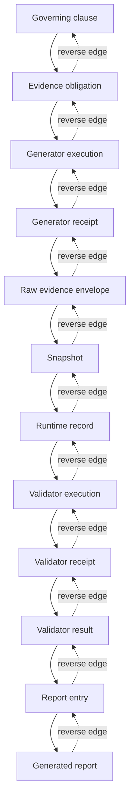

# Campaign Operations Phase H — Legacy Bypass Elimination

## Scope

This increment completes the production integration of the accepted Phase H
trust model. It does not change Campaign Operations database authority,
identities, migrations, workflow state, or the H1–H4 boundary.

## Trusted production flow

All production evidence begins with observed bytes or a direct PostgreSQL
catalog query. Expected manifests are not generator inputs. A registered
generator executes as a separately observed process, receives captured input
snapshot bytes on standard input, and emits a class-specific JSON payload. The
trusted parent binds the process receipt, payload output snapshot, and v2 raw
envelope before an expected value can participate in comparison.

The ACL/default generator is the direct-query specialization. It connects to
the disposable PostgreSQL cluster, queries catalog state independently of all
four expected manifests, captures the raw rows and query receipt, and only
then invokes the comparator with the expected manifest set.


Pathnames are registry metadata. A trusted generator consumes the bytes held
by its parent-captured `ArtifactSnapshot`; it cannot reopen the original input
pathname. Validators consume the recursively captured evidence-root snapshot
set. Persisted validator aggregates are bound back to the per-process output
digests before reuse. An idempotent retry reuses a validator receipt only when
the exact declared input artifact IDs and digests still match.

## Provenance materialization

The generated `h1-provenance-chains.tsv` contains every authoritative
clause-to-obligation derivation. A requirement governed by several clauses has
one row for each reviewed derivation; it does not select or infer a preferred
clause. `h1-provenance-edges.tsv` stores each adjacent edge in both directions.



Readiness fails if any required node, clause/obligation chain, forward edge,
reverse edge, receipt, snapshot, result, or report entry is missing.

## Readiness proof

The only readiness predicate is the conjunction below:

```text
authority_complete
AND trusted_generator_execution_complete
AND raw_envelopes_complete
AND snapshots_complete
AND runtime_records_complete
AND trusted_validator_execution_complete
AND validator_results_complete
AND acl_catalog_independent
AND provenance_graph_complete
AND report_complete
AND no_legacy_path_reachable
```

The disposable integration run `h1-20260802T185411Z-3999` materialized 287
requirements, 287 raw envelopes, 287 runtime records, 287 validator results,
287 report entries, 1,160 reviewed clause/obligation chains, and 5,910 directed
provenance edges. Its graph health contained zero defects and all eleven terms
evaluated true.

## Legacy inventory

`CampaignOperationsH1LegacyInventory.py` is the sole inventory producer.
`CampaignOperationsH1LegacyPathInventory.tsv` is generated from repository
source checks and is verified in `--check` mode. The completed inventory has:

- zero reachable legacy trust paths;
- zero legacy validator paths;
- zero legacy metadata receipts;
- zero legacy report-generation paths;
- zero legacy ACL/default generation paths; and
- zero legacy restore-validation paths.

The removed `H1ACL501` stop and its `trusted-v3-catalog-generator-not-integrated`
diagnostic are absent from production and fixture sources.
