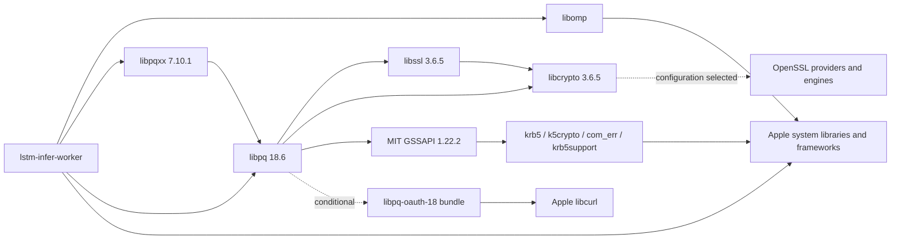

# Phase 24K — Runtime dependency compatibility and deployment policy update

**GO for a later, separately authorized INFER configuration alignment to macOS 27.0+. No implementation or worker build occurred in Phase 24K.** The user explicitly superseded the original 26.2 compatibility objective: the current LSTM Trader development environment now supports macOS **27.0+**, preserves existing Homebrew dependencies and preserves Apple Clang. Investigation of 26.2 replacement dependencies stopped at that instruction. No dependency was downloaded, compiled, installed, replaced or packaged.

The existing candidate is unchanged and still declares 26.2 in its Mach-O metadata. Aligning its checked-in INFER target settings and rebuilding/qualifying a new candidate remain future work. **Production publication/deployment is not approved by this report.** No automatic advance to Phase 24L is made.

## 1. Baseline verification

| Item | Verified result |
| --- | --- |
| Repository / branch | `/Volumes/Developer SSD/ExpertAdvisor-Rollover` / `dedicated-train-layout-rollover-squashed-v1` |
| Initial and final HEAD | `c0aea80a834589469389935f6fe1356214480940`, matching expected `c0aea80a` |
| Initial worktree | `git status --short` and `git diff --stat` empty |
| Phase 24J report | `docs/phases/Phase24/LSTM_Phase24J_RemediationAndQwenRestoration_Output.md`, read in full; committed by `c0aea80a` |
| Candidate | `DerivedData/ExpertAdvisor/Build/Products/Release/lstm-infer-worker` |
| Candidate source commit | `a2bb349ac33c813c9c47e593ed6131ffa7f6092a` |
| Retained identity | Version 1; role `lstm-infer-worker`; semantic layout **13**; model input width **171** |
| Candidate SHA-256, reverified without execution | `3c8120e9da62204ad67041bfe2c39fdf90f66ea6e8a4b0dc719f48b7c8fa922a` |
| Candidate architecture / UUID | Thin ARM64; `6257C34D-86B8-365D-BFE5-7514BDADC48B` |
| Existing provenance | Generated `GeneratedBuildProvenance.hpp` contains the exact `a2bb349a…` commit; `strings` confirms that commit in the unchanged executable |
| Existing binary deployment / SDK | `LC_BUILD_VERSION`: minimum macOS **26.2**, SDK **27.0** |
| Signature | Existing ad-hoc signature; `codesign --verify --strict` passes; no TeamIdentifier |
| Compiler baseline retained | XcodeDefault **Apple clang 21.0.0 (`clang-2100.3.34.2`)**, Xcode 27.0, SDK 27.0; LLVM23 is not selected |

The only difference between the candidate's built source commit and current HEAD is the committed Phase 24J report. Native source and project configuration have not changed since the candidate build. Matching the independently recomputed executable hash to the retained native identity record reestablishes the same artifact without invoking `--build-identity`, inference or training in this phase. The baseline matched, so the stop-on-baseline-difference condition did not trigger.

The Phase 24J report remains valid historical evidence of a 26.2 contract mismatch at that time. The new user authorization supersedes that deployment requirement; it does not retroactively change the executable, the reports, the project or the production environment.

## 2. Dependency inventory and scope

Inspection followed every declared linked-library edge recursively, including strong, weak, re-export, upward, lazy and delay-init attributes. `otool -L/-l/-D`, `file`, `lipo -archs`, `dwarfdump --uuid` and read-only `codesign` inspection cover on-disk non-system images. Xcode's `dyld_info -platform -linked_dylibs` reads Apple images from the current host's dyld shared cache, even where the filesystem contains no standalone dylib. The installed `dyld_info` manual documents that capability. No cache extraction or library execution was needed.

| Inventory measure | Result |
| --- | --- |
| Executable direct linked libraries | 10 strong loads: three non-system and seven system |
| Recursive declared linked-library graph | **698 path nodes / 8,951 edges**, including the executable |
| Non-system linked-library path references | **11**, representing **10 distinct resolved dylib files**; `libcrypto` is reached through both `opt` and Cellar spellings |
| System path nodes | **686**: 143 public-framework paths, 369 private-framework paths, 170 `/usr/lib` paths and four subframework paths |
| Unresolved declared linked-library paths on this host | **0** |
| Additional inspected conditional modules | Five ARM64 bundles: PostgreSQL OAuth helper and four OpenSSL provider/engine modules |

This is a complete recursive **declared linked-library graph on the observed macOS 27 host**, plus the conditional modules identifiable from inspected binaries/installations. It is an overapproximation of images that may be loaded: weak/lazy system edges do not prove all 686 system images load at startup. Arbitrary computed `dlopen` targets and configuration-selected plugins cannot be completely resolved by static inspection; those are explicitly UNKNOWN below. No actual load trace, production connection/authentication configuration or runtime inference was used to close that uncertainty.

### Direct system dependencies

| Load path | Relationship / resolution |
| --- | --- |
| `/System/Library/Frameworks/Foundation.framework/Versions/C/Foundation` | Direct, system dyld shared cache |
| `/System/Library/Frameworks/Metal.framework/Versions/A/Metal` | Direct, system dyld shared cache |
| `/System/Library/Frameworks/MetalPerformanceShaders.framework/Versions/A/MetalPerformanceShaders` | Direct, system dyld shared cache |
| `/System/Library/Frameworks/CoreFoundation.framework/Versions/A/CoreFoundation` | Direct, system dyld shared cache |
| `/usr/lib/libc++.1.dylib` | Direct, Apple C++ runtime; also linked by libpqxx; system cache |
| `/usr/lib/libSystem.B.dylib` | Direct and transitively shared C/system runtime; system cache |
| `/usr/lib/libobjc.A.dylib` | Direct Objective-C runtime; system cache |

The transitive system graph also includes libc++abi, libdispatch/pthread/system component libraries, libresolv, Kerberos.framework, Security, CFNetwork, IOKit, SystemConfiguration, CoreServices, compression/XML/ICU libraries, Swift runtime components and framework-internal dependencies. `/usr/lib/libcurl.4.dylib` is required by the optional OAuth bundle and is already present in the declared system graph. Appendix A lists all 686 system paths and the architectures observed in the host cache. Many cache entries are arm64e, supplied by the OS; this is not an incompatible third-party architecture finding. No Apple system library is proposed for bundling or replacement.

### Non-system linked libraries

All rows below have ARM64 architecture, successful strict signature verification, absolute load paths and **no `LC_RPATH`** in the inspected image. Minimum and SDK values are taken from Mach-O load commands, not inferred from package versions. Absolute `opt` paths resolve through symlinks; Cellar references select the named version directory. The executable itself also has no `LC_RPATH` or weak dylib loads.

| Library load path | Install name (`LC_ID_DYLIB`) | Direct / transitive | Minimum macOS / SDK | SHA-256 |
| --- | --- | --- | --- | --- |
| `/opt/homebrew/opt/libpq/lib/libpq.5.dylib` | `/opt/homebrew/opt/libpq/lib/libpq.5.dylib` | direct | 26.0 / 26.5 | `55032ca06365169dfa41ae4ac646fe4e92a06b33cd77fb5bb27cbbe88fc91534` |
| `/opt/homebrew/opt/libpqxx@7.10.1/lib/libpqxx-7.10.dylib` | `/opt/homebrew/opt/libpqxx@7.10.1/lib/libpqxx-7.10.dylib` | direct | 26.0 / 26.5 | `63ceaee073820e257b15118668ef1fec37bf443b59020388107369555f8c7d40` |
| `/opt/homebrew/opt/libomp/lib/libomp.dylib` | `/opt/homebrew/opt/libomp/lib/libomp.dylib` | direct | 27.0 / 27.0 | `cb679440b0af57131274b6c0bcc11b8c18ef7ad45e2a6625ef57e90379fc2ae4` |
| `/opt/homebrew/opt/openssl@3/lib/libssl.3.dylib` | `/opt/homebrew/opt/openssl@3/lib/libssl.3.dylib` | transitive | 27.0 / 27.0 | `2b343dc7a88d6e49720ae6b939a178b5e688912e682044250203770b8acc2a08` |
| `/opt/homebrew/opt/openssl@3/lib/libcrypto.3.dylib` | `/opt/homebrew/opt/openssl@3/lib/libcrypto.3.dylib` | transitive | 27.0 / 27.0 | `6c7139ae515b274286b2f62d662a173e32d34854e1fc26cca46ee08efe16ae45` |
| `/opt/homebrew/opt/krb5/lib/libgssapi_krb5.2.2.dylib` | `/opt/homebrew/opt/krb5/lib/libgssapi_krb5.2.2.dylib` | transitive | 26.0 / 26.2 | `858331b4c2927aa1f6e8285e3f3019f3f773b92059c22d30fbdba32b1ea45015` |
| `/opt/homebrew/Cellar/openssl@3/3.6.5/lib/libcrypto.3.dylib` | `/opt/homebrew/opt/openssl@3/lib/libcrypto.3.dylib` | transitive | 27.0 / 27.0 | `6c7139ae515b274286b2f62d662a173e32d34854e1fc26cca46ee08efe16ae45` |
| `/opt/homebrew/Cellar/krb5/1.22.2/lib/libkrb5.3.3.dylib` | `/opt/homebrew/opt/krb5/lib/libkrb5.3.3.dylib` | transitive | 26.0 / 26.2 | `cb033326e03f01bf2cea345a47aa8ec2da5c02b95ae2cb692b7adba561bcac70` |
| `/opt/homebrew/Cellar/krb5/1.22.2/lib/libk5crypto.3.1.dylib` | `/opt/homebrew/opt/krb5/lib/libk5crypto.3.1.dylib` | transitive | 26.0 / 26.2 | `004bcd154d90a11a956d143b3e2472e7ddecd9cfc64c6efd577201cd92fe0f3f` |
| `/opt/homebrew/Cellar/krb5/1.22.2/lib/libcom_err.3.0.dylib` | `/opt/homebrew/opt/krb5/lib/libcom_err.3.0.dylib` | transitive | 26.0 / 26.2 | `e2a6ca551f8e78698ee1f75326de028fa1f8b3290af2de113eadb6aef5eb1463` |
| `/opt/homebrew/Cellar/krb5/1.22.2/lib/libkrb5support.1.1.dylib` | `/opt/homebrew/opt/krb5/lib/libkrb5support.1.1.dylib` | transitive | 26.0 / 26.2 | `672b97f5f3c04b54ef0cdfa7cf3b2df795bebb49236d2294a792dd59ff891fc7` |

Resolved on-disk file paths:

| Load path | Resolved path |
| --- | --- |
| `/opt/homebrew/opt/libpq/lib/libpq.5.dylib` | `/Volumes/Darwin/homebrew/Cellar/libpq/18.6/lib/libpq.5.dylib` |
| `/opt/homebrew/opt/libpqxx@7.10.1/lib/libpqxx-7.10.dylib` | `/Volumes/Darwin/homebrew/Cellar/libpqxx@7.10.1/7.10.1/lib/libpqxx-7.10.dylib` |
| `/opt/homebrew/opt/libomp/lib/libomp.dylib` | `/Volumes/Darwin/homebrew/Cellar/libomp/23.1.3/lib/libomp.dylib` |
| `/opt/homebrew/opt/openssl@3/lib/libssl.3.dylib` | `/Volumes/Darwin/homebrew/Cellar/openssl@3/3.6.5/lib/libssl.3.dylib` |
| `/opt/homebrew/opt/openssl@3/lib/libcrypto.3.dylib` | `/Volumes/Darwin/homebrew/Cellar/openssl@3/3.6.5/lib/libcrypto.3.dylib` |
| `/opt/homebrew/opt/krb5/lib/libgssapi_krb5.2.2.dylib` | `/Volumes/Darwin/homebrew/Cellar/krb5/1.22.2/lib/libgssapi_krb5.2.2.dylib` |
| `/opt/homebrew/Cellar/openssl@3/3.6.5/lib/libcrypto.3.dylib` | `/Volumes/Darwin/homebrew/Cellar/openssl@3/3.6.5/lib/libcrypto.3.dylib` |
| `/opt/homebrew/Cellar/krb5/1.22.2/lib/libkrb5.3.3.dylib` | `/Volumes/Darwin/homebrew/Cellar/krb5/1.22.2/lib/libkrb5.3.3.dylib` |
| `/opt/homebrew/Cellar/krb5/1.22.2/lib/libk5crypto.3.1.dylib` | `/Volumes/Darwin/homebrew/Cellar/krb5/1.22.2/lib/libk5crypto.3.1.dylib` |
| `/opt/homebrew/Cellar/krb5/1.22.2/lib/libcom_err.3.0.dylib` | `/Volumes/Darwin/homebrew/Cellar/krb5/1.22.2/lib/libcom_err.3.0.dylib` |
| `/opt/homebrew/Cellar/krb5/1.22.2/lib/libkrb5support.1.1.dylib` | `/Volumes/Darwin/homebrew/Cellar/krb5/1.22.2/lib/libkrb5support.1.1.dylib` |

The duplicate crypto rows resolve to the same file and hash; they are not two independent OpenSSL runtimes. Conversely, exact internal Cellar references in libssl and Kerberos mean changing only the executable's direct library search paths would not redirect their transitive links. The recommended policy-only change redirects none of them.



### Conditional modules and plugin uncertainty

The OAuth path is identified directly by `dyld_info -dlopens` on libpq. PostgreSQL 18 supports an optional OAuth client module, with libcurl used for client flows; upstream build documentation and source distinguish this from libpq's normal shared-library link dependencies. [PostgreSQL build requirements](https://www.postgresql.org/docs/18/install-requirements.html), [libpq Makefile](https://raw.githubusercontent.com/postgres/postgres/REL_18_STABLE/src/interfaces/libpq/Makefile).

These five inspected files are **Mach-O ARM64 bundles**, so they have no `LC_ID_DYLIB` install name. Each passed strict signature verification. Their paths resolve under the respective Cellar prefixes listed above; their load mechanism is `dlopen`/plugin discovery, not a direct executable link.

| Conditional module path | Minimum macOS / SDK | SHA-256 | Dependencies |
| --- | --- | --- | --- |
| `/opt/homebrew/opt/libpq/lib/libpq-oauth-18.dylib` | 26.0 / 26.5 | `73346e4086b956680eda453c6031d0062ac951e6b5e2b6e64737e84bbac5d26b` | `/opt/homebrew/opt/libpq/lib/libpq.5.dylib`; `/usr/lib/libcurl.4.dylib`; `/usr/lib/libSystem.B.dylib` |
| `/opt/homebrew/opt/openssl@3/lib/ossl-modules/legacy.dylib` | 27.0 / 27.0 | `db683fd24e83792107473e45918611a48cb38452ab371848ed8ee556251a2a97` | `/opt/homebrew/Cellar/openssl@3/3.6.5/lib/libcrypto.3.dylib`; `/usr/lib/libSystem.B.dylib` |
| `/opt/homebrew/opt/openssl@3/lib/engines-3/padlock.dylib` | 27.0 / 27.0 | `d3bb0fe74331ee49752e318afa8430187ab24d464030a97e37cb63caaea94605` | `/opt/homebrew/Cellar/openssl@3/3.6.5/lib/libcrypto.3.dylib`; `/usr/lib/libSystem.B.dylib` |
| `/opt/homebrew/opt/openssl@3/lib/engines-3/capi.dylib` | 27.0 / 27.0 | `225962b015687e7222ba42d4a597644b6704d41a9e9cbe76867feeebdecaf473` | `/opt/homebrew/Cellar/openssl@3/3.6.5/lib/libcrypto.3.dylib`; `/usr/lib/libSystem.B.dylib` |
| `/opt/homebrew/opt/openssl@3/lib/engines-3/loader_attic.dylib` | 27.0 / 27.0 | `16299628b7e2270d385a14b794a9d800de225fd6a151f6119ab8459baf779de4` | `/opt/homebrew/Cellar/openssl@3/3.6.5/lib/libcrypto.3.dylib`; `/usr/lib/libSystem.B.dylib` |

The OAuth helper points back to libpq and to Apple libcurl/libSystem. OpenSSL modules point to the exact current libcrypto Cellar file and libSystem. Their 27.0 minimums meet the newly approved 27.0 policy; no provider replacement is required by a deployment-floor mismatch.

libomp's static `dlopen` scan identifies `libittnotify.dylib`, `libarcher.so` and an unknown computed target. libcrypto and krb5support also have computed targets. Their activation, search paths and actual use were not determined by reading live process environments or production authentication/configuration. No third-party module with a minimum above 27.0 was found in the inspected installation, but arbitrary externally configured plugins remain **UNKNOWN**. The loader scan is not proof that any optional tool/plugin is active or required for inference. Existing installed plugin/configuration behavior is preserved; no environment or provider setting was changed.

ICU/readline appear in the libpq Homebrew receipt but are not in libpq's inspected dynamic dependency edges. They support other products/build features; they are not extra non-system dylibs loaded by this INFER graph merely because the formula lists them. Apple ICU libraries in the system graph are distinct from Homebrew ICU. Build-receipt dependencies and actual loader dependencies are recorded separately.

## 3. Deployment contract: original metadata and new policy

| Evidence layer | Observed value / implication |
| --- | --- |
| New explicit user policy | **macOS 27.0+ for the current LSTM Trader development environment**; 26.2 compatibility no longer required |
| Checked-in INFER target Debug | `0F8000503800000100AAA001`, `MACOSX_DEPLOYMENT_TARGET = 26.2` |
| Checked-in INFER target Release | `0F8000513800000100AAA001`, `MACOSX_DEPLOYMENT_TARGET = 26.2` |
| Current effective INFER Release settings | Read with `xcodebuild -showBuildSettings` only: 26.2, arm64, SDK 27.0, optimization 3, existing Homebrew include/link paths |
| Existing Phase 24J linker invocation | XcodeDefault `clang++`, `-target arm64-apple-macos26.2`, macOS 27.0 SDK, `-O3`, `-lpq -lpqxx -lomp` |
| Existing Mach-O `LC_BUILD_VERSION` | Minimum 26.2, SDK 27.0 |
| Existing documentation | Phase 24F and 24J describe the historical 26.2 floor; this report records its explicit policy supersession for current development |
| Direct library minimums | libomp 27.0; libpq and libpqxx 26.0 |
| Transitive library minimums | libssl/libcrypto 27.0; MIT Kerberos libraries 26.0 |
| Actual runtime evidence | Phase 24J identity query succeeded on macOS 27.0.1; no new execution in this phase; no exact macOS 27.0 test or full inference/training qualification |

**No inspected required non-system library declares a minimum higher than the newly supported 27.0 floor.** The former libomp/OpenSSL 26.2 incompatibility concern therefore no longer requires replacement dependencies for this development policy. It remains incorrect to describe the unchanged artifact as a newly built or metadata-aligned 27.0 candidate. Its 26.2 load command is a declaration, not evidence of a compatible 26.2 runtime closure.

SDK version and deployment minimum are different. Preserve the existing macOS SDK selection and Apple Clang; change the target deployment setting only. Do not switch to the invalid discovered LLVM23 toolchain. The repository's historical Xcode 26.5 wording differs from the installed Xcode 27.0 baseline; future validation should explicitly record/accept the actual Apple toolchain, without replacing the compiler or dependencies in this phase.

All direct/transitive third-party minimums are compatible **at the declared-version level** with 27.0. This does not prove symbol availability, every optional plugin, GPU correctness, TLS/authentication behavior, signing acceptance or inference correctness on every supported 27.x host. Those remain separate verification boundaries.

## 4. Minimal recommended Xcode changes — not applied

The INFER scheme's BlueprintIdentifier is `0F8000043800000100AAA001`, selecting the distinct `lstm-infer-worker` PBXNativeTarget. It uses Release for launch/profile/analyze/archive, and Debug for its test action.

The absolute minimum for the Release candidate is **one value edit** in `ExpertAdvisor.xcodeproj/project.pbxproj`:

```text
Configuration: 0F8000513800000100AAA001 (lstm-infer-worker / Release)
MACOSX_DEPLOYMENT_TARGET = 26.2;
                     -> 27.0;
```

**Recommended scope: two INFER-only value edits**, setting both its Release configuration above and Debug configuration `0F8000503800000100AAA001` to 27.0. This consistently reflects the new development policy across the target's configurations. It does not alter the TRAIN configuration objects or shared libraries. No compiler, optimization, header search path, linker library, rpath, scheme, registry, signing or build-directory change is needed to remove the specific floor mismatch under the revised policy.

Do not set a project-wide deployment floor, replace every `26.2` occurrence, or add a global command-line `MACOSX_DEPLOYMENT_TARGET=27.0` override. Those approaches can alter the behavior of other targets/dependency builds or conceal a checked-in setting mismatch. Keep the existing Release finite-value optimization remediation (`-O3`) intact. Do not edit Mach-O metadata in the existing candidate to simulate a new build.

This report documents the change; **neither value was edited** in Phase 24K. The policy is authorized, while implementation/building/publishing are expressly excluded from this phase.

## 5. TRAIN and shared-target implications

| Configuration scope | Current setting | Effect of recommended INFER-only edits |
| --- | --- | --- |
| INFER Debug / Release | Explicit 26.2 / 26.2 | Later recommended 27.0 / 27.0; newer minimum can change compile-time API availability and requires a new candidate/hash |
| TRAIN Debug | `0FA000063A00000100AAA001`, explicit 26.2 | **No configuration change** |
| TRAIN Release | `0FA000073A00000100AAA001`, explicit 26.2 | **No configuration change** |
| Project Debug / Release defaults | `0845055E2047962100A0B88F` / `0845055F2047962100A0B88F`, 26.2 | Retained; explicit INFER override controls INFER |
| ProfitabilityCore, StrategyEvaluationCore, SchedulerCore, ModelInputPreparation, MarketDataCore | Explicit 15.0 in Debug / Release; static archives | Retained; linking lower-floor objects into a 27.0 executable does not itself require raising them |
| Shared MetaNN static target | Explicit 26.2 in Debug / Release | Retained; no shared-project change |
| Shared MetaNN_metal target | Explicit 26.2 in Debug / Release | Retained; no shared-source or Metal build/configuration change |
| Shared MetalBuffer static target | Explicit 26.2 in Debug / Release | Retained; no shared-project change |
| Other executables: scheduler/observer/analyze/legacy/PocketResearch | Separate explicit 26.2 entries | Retained; not included in a global policy migration |

A target's explicit setting is separate from other targets' configuration objects. Raising INFER's setting does not automatically raise TRAIN or its libraries. The distinction is confirmed by the parsed target/configuration IDs and recorded per-target effective settings, rather than assuming a dependency inherits its consuming executable's target override.

**TRAIN implication requiring separate review:** TRAIN Debug and Release are configured to link the same Homebrew libomp/libpq/libpqxx paths. Therefore a future TRAIN build against this installed dependency closure would have an effective dependency floor of at least 27.0 despite its present 26.2 executable setting. The new current-environment policy does not establish retained 26.2 TRAIN loadability. Conversely, this report has not inspected or qualified a specific TRAIN artifact, and does not infer the dependency state of immutable production TRAIN binaries from Rollover project settings.

Do not silently extend the INFER edit to TRAIN. If the new 27.0 development policy is to be reflected in TRAIN metadata too, document that it removes the declared 26.2 minimum, changes compile-time availability, requires a separate clean-provenance build/hash/identity qualification and does not authorize operating or replacing production TRAIN workers. Record that scope choice before implementation. No TRAIN compatibility setting, binary, process, scheduler or workload changed here.

The lower floors on static archives are object-compilation settings, not standalone guarantees that the complete application and its external closure run on those older systems. They can remain as-is for this narrowly scoped change; modifying them would broaden the numerical/build surface and could affect both workers.

## 6. Options under the revised policy

| Option | Assessment / recommendation |
| --- | --- |
| Preserve current Homebrew dependencies and align INFER target metadata to 27.0 | **Recommended**. Minimal INFER-only settings change; keeps Apple Clang and existing Release workflow; no dependency replacement or packaging |
| Original Option A: build 26.2 dependencies in a private prefix | **Withdrawn from the active plan** by explicit user authorization; investigation stopped; do not download or compile |
| Original Option B: obtain alternative 26.2 artifacts | **Not needed for the new floor**. Before the update, bounded local inspection found the alternate LLVM 23.1.2 libomp also declared 27.0; no further older-version investigation continued |
| Original Option C: targeted runtime packaging/install-name rewrites | **Not required for this policy alignment and not recommended in this phase**. Preserve existing paths; copying/relabeling an older artifact does not establish a different compatibility floor |
| Global deployment-target change or compiler switch | Broader than necessary; do not use |

The current development environment remains dependent on the named Homebrew paths and versions. Reproducibility here means recording and verifying that environment; the recommendation does not promise a self-contained distribution to a machine without these dependencies. A future distribution requirement would need its own runtime-path, dependency-lock, plugin and signing design. Run-path linking uses `@rpath` plus executable load-command search paths, but introducing it is an optional future packaging change, not necessary to implement the authorized deployment-floor update. [Apple run-path documentation](https://developer.apple.com/library/archive/documentation/DeveloperTools/Conceptual/DynamicLibraries/100-Articles/RunpathDependentLibraries.html).

## 7. Reproducibility and future verification plan

### Existing dependency baseline to preserve

| Package | Observed installed version / origin | Required handling |
| --- | --- | --- |
| libomp | 23.1.3, Homebrew bottle | Preserve current installed artifact and record hash |
| OpenSSL | 3.6.5, Homebrew bottle | Preserve libssl/libcrypto and configured providers/engines |
| libpq | 18.6, Homebrew bottle | Preserve SSL/GSSAPI/OAuth capability surface and current resolution |
| MIT Kerberos | 1.22.2, Homebrew bottle | Preserve its full transitive closure; no removal/replacement with Apple's implementation |
| libpqxx | 7.10.1, existing `vpredoehl/local` formula, source-built | Preserve headers/ABI/library path; no version migration |
| Apple compiler / SDK | Apple clang 21.0.0 (`clang-2100.3.34.2`), Xcode 27.0, SDK 27.0 | Explicitly record XcodeDefault selection; retain ARM64 and target-level 27.0 |

Installed `.brew` formulas and `INSTALL_RECEIPT.json` were read for provenance. Formula source URLs and expected source archive checksums were recorded **before the policy update**, but no archive was downloaded or verified and no dependency preparation plan is now active. The library hashes in section 2 are verified hashes of installed binaries, not prospective compatible rebuilds. Receipts show libpq/libpqxx were built against earlier installed dependencies that now resolve through updated `opt` links; their historical build inputs do not pin the current runtime closure. The current inspected graph/hashes are the relevant environment snapshot.

Future scoped implementation/validation, only in a separately authorized phase:

1. Make the agreed INFER-only setting edits and update an appropriate current deployment-policy document/test guard. Preserve historical Phase 24F/J reports as historical evidence. No global target or TRAIN edit without explicitly documenting scope and implications.
2. Review the exact project diff; ensure Apple Clang/XcodeDefault, `-O3`, arm64, existing dependencies and all shared projects/symlinks remain intact. Prefer a structural assertion for the INFER configuration IDs/policy that also detects unintended changes to TRAIN/shared settings.
3. Commit reviewed source/configuration/documentation changes separately and require a clean source worktree before provenance-sensitive builds. Do not build from this uncommitted report state or bypass provenance checks.
4. Recheck effective INFER Debug/Release settings. Expect `MACOSX_DEPLOYMENT_TARGET=27.0`; record TRAIN and shared target values independently to verify the agreed scope. Confirm all build products/caches/temp paths are under Rollover DerivedData; no `CONFIGURATION_BUILD_DIR` override and no Clean.
5. If later authorized to build, use the existing `LSTM Infer Worker` / Release / ARM64 scheme and only its required dependencies; preserve the shared MetaNN symlink and Apple compiler. Expected compiler/linker target is `arm64-apple-macos27.0`. No dependency download/build/package step is needed.
6. Inspect the resulting Mach-O and graph: minimum 27.0; SDK recorded independently; ARM64; unchanged intended dependency paths/versions; every required non-system minimum at most 27.0; no unexpected rpath, missing symbol, architecture or deployment warning. The previous libomp 27.0-vs-26.2 warning should disappear for INFER; warning-free compilation is not promised for unrelated categories.
7. Reverify signed final bytes, generated and embedded exact new source commit, role `lstm-infer-worker`, identity version 1, layout 13, width 171, independent executable SHA-256 and native publication-contract acceptance/rejection tests. A target/minimum change can produce different code and hash; do not reuse the Phase 24J hash/identity as a new candidate's qualification.
8. Run the finite-value regression/negative control, feature-layout/width/parity and relevant structural/publication regressions. A metadata change must not reintroduce `-Ofast` into the corrected validation-bearing libraries or alter feature formulas.
9. Establish runtime compatibility on the actual supported minimum **macOS 27.0 ARM64** environment using separately approved isolated checks. The existing 27.0.1 identity success is current-host evidence, not an exact-floor test or full runtime correctness test. Any TLS/GSSAPI/OAuth/GPU checks require isolated fixtures and specific authorization; never use production databases/schedulers/experiments as test fixtures.
10. Keep publication, registries, production workers and deployment outside this implementation/validation authorization. A passed build or identity contract is not production publication approval.

Read-only verification command templates (not a worker build or launch):

```bash
git branch --show-current
git rev-parse HEAD
git status --short
shasum -a 256 '/absolute/path/to/candidate'
file '/absolute/path/to/candidate'
lipo -archs '/absolute/path/to/candidate'
otool -L '/absolute/path/to/candidate'
otool -l '/absolute/path/to/candidate'
otool -D '/absolute/path/to/non-system/library'
dwarfdump --uuid '/absolute/path/to/candidate'
codesign --verify --strict '/absolute/path/to/candidate'
xcrun --find clang++
xcrun clang --version
xcrun --sdk macosx --show-sdk-path
xcrun dyld_info -platform -linked_dylibs '/absolute/path/to/image'
xcrun dyld_info -dlopens '/absolute/path/to/non-system/image'
```

Repeat dependency inspection recursively, preserving edge attributes and canonical paths; do not count two aliases of one file as two independent libraries. Record signed hashes and code-signing metadata after any future build/sign step. No install-name mutation, environment-based `DYLD_LIBRARY_PATH` workaround, package installation, source retrieval or signing operation occurred in this phase.

## 8. Remaining risks and acceptance boundaries

| Finding | Assessment under authorized 27.0 policy |
| --- | --- |
| libomp/libssl/libcrypto minimum 27.0 | No declared-floor incompatibility with supported 27.0+ development hosts; keep existing dependencies |
| Current INFER settings/artifact still 26.2 | **Action required for policy/metadata alignment**; recommended change not applied here |
| TRAIN metadata remains 26.2 against shared 27.0 dependencies | Separate scope/policy-consistency issue; no retained 26.2 TRAIN compatibility claim or change |
| `opt` and Cellar runtime dependencies | Homebrew updates can change the closure without changing worker SHA; record/pin operational dependency baseline and requalify after updates |
| Conditional/computed plugins | **UNKNOWN** complete configured runtime set; inspect isolated actual configuration and exercise required paths in later authorized validation |
| Exact minimum-host runtime behavior | **Unverified on macOS 27.0**; Phase 24J provides only 27.0.1 identity/load evidence |
| Code signing | Candidate and inspected libraries/modules pass strict verification; current worker is ad-hoc with `get-task-allow=true`; Developer ID/notarization/distribution acceptance is separate |
| Full model/GPU/database behavior | Not run or newly qualified in Phase 24K; preserve existing feature identity and required later regression boundaries |
| Toolchain reproduction | Preserve Apple Clang; record actual Xcode 27.0 baseline versus historical 26.5 instructions explicitly |
| Production readiness | No publication/deployment approval; no production artifact/process/database/scheduler/registry operation |

**GO for the narrowly scoped future INFER configuration implementation**, subject to choosing Release-only versus the recommended Debug+Release scope and explicitly treating TRAIN separately. **NO-GO for treating the unchanged candidate as newly aligned/qualified, or for production publication/deployment based only on this investigation.** The new policy removes the need for a 26.2 dependency replacement project; it does not substitute for verification of a later build.

Decisions for a later implementation phase: adopt the recommended two INFER-only settings edits (or explicitly limit to Release); decide whether TRAIN development metadata should also be aligned in a separate documented change; record the retained Apple Xcode/toolchain baseline and intended exact-floor validation environment. The macOS 27.0 policy itself is already explicitly authorized and does not need to be reapproved. No decision authorizes a build or deployment during Phase 24K.

## 9. Work performed, protection and final state

Read-only work: Git branch/HEAD/status/diffs; full Phase 24J report; binary/provenance/hash inspection; recursive Mach-O/dyld-cache dependency metadata; installed formula/receipt/module metadata; parsed target settings and scheme selection; `xcodebuild -showBuildSettings` only. The settings invocation contained **no `build`, `test`, `archive`, `analyze` or `clean` action**, used Rollover DerivedData/caches/temp isolation, and left the candidate hash unchanged. No source tests, native/dependency compiles or worker executions ran.

Before the revised authorization, upstream documentation/release metadata were consulted and bounded installed alternatives inspected. Those activities fetched documentation only, not dependency archives or artifacts. All further older-compatible dependency investigation stopped at the policy update. No source/download/build/package recipe is implemented or recommended under the revised scope.

The existing Qwen model `mlx-community/Qwen3-Coder-30B-A3B-Instruct-4bit` and `expertadvisor-repository-rollover` integration are preserved. No Qwen query/benchmark/configuration change, RepositoryAgent source edit or Ollama restart occurred in this phase. RepositoryAgent's preexisting modified/untracked status was preserved.

Production HEAD remains `b8cdfef03ccdb073caccbf93b0a4282070c0c4d3`; its worktree remains clean. The MetaNN symlink remains `/Volumes/Developer SSD/ExpertAdvisor/MetaNN`. The retained 265-file shared MetaNN snapshot matched during this investigation. Installed library/module hashes and Rollover/shared project hashes are checked again at completion. No production database, experiment, scheduler, worker, registry, binary or shared source was modified. No Homebrew command installed/upgraded/linked anything; only existing files and inspection utilities were read/used. No commit or merge was made.

Only this report is an untracked deliverable:

```text
?? docs/phases/Phase24/LSTM_Phase24K_RuntimeDependencyCompatibility_Output.md
```

`git diff --stat` is empty. Production/current candidate remain unchanged. Stop here: no implementation, Phase 24L, rebuild, publication or deployment.

Evidence (ignored, disposable analysis files only) is retained under `DerivedData/ExpertAdvisor/Phase24K`: `baseline.json`, `dependency-closure.json`, `dependency-edges.tsv`, `system-inventory.tsv`, `non-system-inventory.json`, `conditional-modules.json`, `installed-source-provenance.json`, `effective-release-settings.*`, `phase24j-link-invocation.txt`, `deployment-settings-by-target.json`, `deployment-scope.json` and final protection verification. The graph records every edge and inspection command/result; Appendix A retains all system path names in this report even if disposable DerivedData is later removed.

## Appendix A. Complete declared system-path inventory on the inspected host

This list is the recursive host-cache linked-library inventory, including weak/lazy/re-export edges. It is not a list of separately bundled runtime files or a claim that every path exists as an on-disk file. Every path was readable by `dyld_info`; system cache content belongs to the installed OS and differs across OS versions. Full importer/edge attributes are in `dependency-closure.json` and `dependency-edges.tsv`.

<details>
<summary>686 Apple system image paths and observed cache architecture</summary>

| System load path | Observed architecture |
| --- | --- |
| `/System/Library/Frameworks/AVFAudio.framework/Versions/A/AVFAudio` | arm64e |
| `/System/Library/Frameworks/AVFoundation.framework/Versions/A/AVFoundation` | arm64e |
| `/System/Library/Frameworks/AVRouting.framework/Versions/A/AVRouting` | arm64e |
| `/System/Library/Frameworks/Accelerate.framework/Versions/A/Accelerate` | arm64e |
| `/System/Library/Frameworks/Accelerate.framework/Versions/A/Frameworks/vImage.framework/Versions/A/Libraries/libCGInterfaces.dylib` | arm64e |
| `/System/Library/Frameworks/Accelerate.framework/Versions/A/Frameworks/vImage.framework/Versions/A/vImage` | arm64e |
| `/System/Library/Frameworks/Accelerate.framework/Versions/A/Frameworks/vecLib.framework/Versions/A/libBLAS.dylib` | arm64e |
| `/System/Library/Frameworks/Accelerate.framework/Versions/A/Frameworks/vecLib.framework/Versions/A/libBNNS.dylib` | arm64e |
| `/System/Library/Frameworks/Accelerate.framework/Versions/A/Frameworks/vecLib.framework/Versions/A/libLAPACK.dylib` | arm64e |
| `/System/Library/Frameworks/Accelerate.framework/Versions/A/Frameworks/vecLib.framework/Versions/A/libLinearAlgebra.dylib` | arm64e |
| `/System/Library/Frameworks/Accelerate.framework/Versions/A/Frameworks/vecLib.framework/Versions/A/libQuadrature.dylib` | arm64e |
| `/System/Library/Frameworks/Accelerate.framework/Versions/A/Frameworks/vecLib.framework/Versions/A/libSparse.dylib` | arm64e |
| `/System/Library/Frameworks/Accelerate.framework/Versions/A/Frameworks/vecLib.framework/Versions/A/libSparseBLAS.dylib` | arm64e |
| `/System/Library/Frameworks/Accelerate.framework/Versions/A/Frameworks/vecLib.framework/Versions/A/libvDSP.dylib` | arm64e |
| `/System/Library/Frameworks/Accelerate.framework/Versions/A/Frameworks/vecLib.framework/Versions/A/libvMisc.dylib` | arm64e |
| `/System/Library/Frameworks/Accelerate.framework/Versions/A/Frameworks/vecLib.framework/Versions/A/vecLib` | arm64e |
| `/System/Library/Frameworks/Accounts.framework/Versions/A/Accounts` | arm64e |
| `/System/Library/Frameworks/AppIntents.framework/Versions/A/AppIntents` | arm64e |
| `/System/Library/Frameworks/AppIntentsTypeSupport.framework/Versions/A/AppIntentsTypeSupport` | arm64e |
| `/System/Library/Frameworks/ApplicationServices.framework/Versions/A/ApplicationServices` | arm64e |
| `/System/Library/Frameworks/ApplicationServices.framework/Versions/A/Frameworks/ATS.framework/Versions/A/ATS` | arm64e |
| `/System/Library/Frameworks/ApplicationServices.framework/Versions/A/Frameworks/ATS.framework/Versions/A/Resources/libFontRegistry.dylib` | arm64e |
| `/System/Library/Frameworks/ApplicationServices.framework/Versions/A/Frameworks/ATSUI.framework/Versions/A/ATSUI` | arm64e |
| `/System/Library/Frameworks/ApplicationServices.framework/Versions/A/Frameworks/ColorSyncLegacy.framework/Versions/A/ColorSyncLegacy` | arm64e |
| `/System/Library/Frameworks/ApplicationServices.framework/Versions/A/Frameworks/HIServices.framework/Versions/A/HIServices` | arm64e |
| `/System/Library/Frameworks/ApplicationServices.framework/Versions/A/Frameworks/PrintCore.framework/Versions/A/PrintCore` | arm64e |
| `/System/Library/Frameworks/ApplicationServices.framework/Versions/A/Frameworks/QD.framework/Versions/A/QD` | arm64e |
| `/System/Library/Frameworks/ApplicationServices.framework/Versions/A/Frameworks/SpeechSynthesis.framework/Versions/A/SpeechSynthesis` | arm64e |
| `/System/Library/Frameworks/AudioToolbox.framework/Versions/A/AudioToolbox` | arm64e |
| `/System/Library/Frameworks/AudioUnit.framework/Versions/A/AudioUnit` | arm64e |
| `/System/Library/Frameworks/CFNetwork.framework/Versions/A/CFNetwork` | arm64e |
| `/System/Library/Frameworks/ClassKit.framework/Versions/A/ClassKit` | arm64e |
| `/System/Library/Frameworks/CloudKit.framework/Versions/A/CloudKit` | arm64e |
| `/System/Library/Frameworks/ColorSync.framework/Versions/A/ColorSync` | arm64e |
| `/System/Library/Frameworks/Combine.framework/Versions/A/Combine` | arm64e |
| `/System/Library/Frameworks/Contacts.framework/Versions/A/Contacts` | arm64e |
| `/System/Library/Frameworks/CoreAudio.framework/Versions/A/CoreAudio` | arm64e |
| `/System/Library/Frameworks/CoreBluetooth.framework/Versions/A/CoreBluetooth` | arm64e |
| `/System/Library/Frameworks/CoreData.framework/Versions/A/CoreData` | arm64e |
| `/System/Library/Frameworks/CoreDisplay.framework/Versions/A/CoreDisplay` | arm64e |
| `/System/Library/Frameworks/CoreFoundation.framework/Versions/A/CoreFoundation` | arm64e |
| `/System/Library/Frameworks/CoreGraphics.framework/Versions/A/CoreGraphics` | arm64e |
| `/System/Library/Frameworks/CoreImage.framework/Versions/A/CoreImage` | arm64e |
| `/System/Library/Frameworks/CoreLocation.framework/Versions/A/CoreLocation` | arm64e |
| `/System/Library/Frameworks/CoreMIDI.framework/Versions/A/CoreMIDI` | arm64e |
| `/System/Library/Frameworks/CoreML.framework/Versions/A/CoreML` | arm64e |
| `/System/Library/Frameworks/CoreMedia.framework/Versions/A/CoreMedia` | arm64e |
| `/System/Library/Frameworks/CoreMediaIO.framework/Versions/A/CoreMediaIO` | arm64e |
| `/System/Library/Frameworks/CoreMotion.framework/Versions/A/CoreMotion` | arm64e |
| `/System/Library/Frameworks/CoreServices.framework/Versions/A/CoreServices` | arm64e |
| `/System/Library/Frameworks/CoreServices.framework/Versions/A/Frameworks/AE.framework/Versions/A/AE` | arm64e |
| `/System/Library/Frameworks/CoreServices.framework/Versions/A/Frameworks/CarbonCore.framework/Versions/A/CarbonCore` | arm64e |
| `/System/Library/Frameworks/CoreServices.framework/Versions/A/Frameworks/DictionaryServices.framework/Versions/A/DictionaryServices` | arm64e |
| `/System/Library/Frameworks/CoreServices.framework/Versions/A/Frameworks/FSEvents.framework/Versions/A/FSEvents` | arm64e |
| `/System/Library/Frameworks/CoreServices.framework/Versions/A/Frameworks/LaunchServices.framework/Versions/A/LaunchServices` | arm64e |
| `/System/Library/Frameworks/CoreServices.framework/Versions/A/Frameworks/Metadata.framework/Versions/A/Metadata` | arm64e |
| `/System/Library/Frameworks/CoreServices.framework/Versions/A/Frameworks/OSServices.framework/Versions/A/OSServices` | arm64e |
| `/System/Library/Frameworks/CoreServices.framework/Versions/A/Frameworks/SearchKit.framework/Versions/A/SearchKit` | arm64e |
| `/System/Library/Frameworks/CoreServices.framework/Versions/A/Frameworks/SharedFileList.framework/Versions/A/SharedFileList` | arm64e |
| `/System/Library/Frameworks/CoreSpotlight.framework/Versions/A/CoreSpotlight` | arm64e |
| `/System/Library/Frameworks/CoreTelephony.framework/Versions/A/CoreTelephony` | arm64e |
| `/System/Library/Frameworks/CoreText.framework/Versions/A/CoreText` | arm64e |
| `/System/Library/Frameworks/CoreTransferable.framework/Versions/A/CoreTransferable` | arm64e |
| `/System/Library/Frameworks/CoreVideo.framework/Versions/A/CoreVideo` | arm64e |
| `/System/Library/Frameworks/CoreWLAN.framework/Versions/A/CoreWLAN` | arm64e |
| `/System/Library/Frameworks/CryptoKit.framework/Versions/A/CryptoKit` | arm64e |
| `/System/Library/Frameworks/CryptoTokenKit.framework/Versions/A/CryptoTokenKit` | arm64e |
| `/System/Library/Frameworks/DataDetection.framework/Versions/A/DataDetection` | arm64e |
| `/System/Library/Frameworks/DeveloperToolsSupport.framework/Versions/A/DeveloperToolsSupport` | arm64e |
| `/System/Library/Frameworks/DiscRecording.framework/Versions/A/DiscRecording` | arm64e |
| `/System/Library/Frameworks/DiskArbitration.framework/Versions/A/DiskArbitration` | arm64e |
| `/System/Library/Frameworks/ExtensionFoundation.framework/Versions/A/ExtensionFoundation` | arm64e |
| `/System/Library/Frameworks/FileProvider.framework/Versions/A/FileProvider` | arm64e |
| `/System/Library/Frameworks/Foundation.framework/Versions/C/Foundation` | arm64e |
| `/System/Library/Frameworks/GSS.framework/Versions/A/GSS` | arm64e |
| `/System/Library/Frameworks/GeoToolbox.framework/Versions/A/GeoToolbox` | arm64e |
| `/System/Library/Frameworks/IOBluetooth.framework/Versions/A/IOBluetooth` | arm64e |
| `/System/Library/Frameworks/IOKit.framework/Versions/A/IOKit` | arm64e |
| `/System/Library/Frameworks/IOSurface.framework/Versions/A/IOSurface` | arm64e |
| `/System/Library/Frameworks/ImageIO.framework/Versions/A/ImageIO` | arm64e |
| `/System/Library/Frameworks/ImageIO.framework/Versions/A/Resources/libGIF.dylib` | arm64e |
| `/System/Library/Frameworks/ImageIO.framework/Versions/A/Resources/libJP2.dylib` | arm64e |
| `/System/Library/Frameworks/ImageIO.framework/Versions/A/Resources/libJPEG.dylib` | arm64e |
| `/System/Library/Frameworks/ImageIO.framework/Versions/A/Resources/libPng.dylib` | arm64e |
| `/System/Library/Frameworks/ImageIO.framework/Versions/A/Resources/libRadiance.dylib` | arm64e |
| `/System/Library/Frameworks/ImageIO.framework/Versions/A/Resources/libTIFF.dylib` | arm64e |
| `/System/Library/Frameworks/Intents.framework/Versions/A/Intents` | arm64e |
| `/System/Library/Frameworks/Kerberos.framework/Versions/A/Kerberos` | arm64e |
| `/System/Library/Frameworks/Kerberos.framework/Versions/A/Libraries/libHeimdalProxy.dylib` | arm64e |
| `/System/Library/Frameworks/LDAP.framework/Versions/A/LDAP` | arm64e |
| `/System/Library/Frameworks/LightweightCodeRequirements.framework/Versions/A/LightweightCodeRequirements` | arm64e |
| `/System/Library/Frameworks/LocalAuthentication.framework/Support/SharedUtils.framework/Versions/A/SharedUtils` | arm64e |
| `/System/Library/Frameworks/LocalAuthentication.framework/Versions/A/LocalAuthentication` | arm64e |
| `/System/Library/Frameworks/MLCompute.framework/Versions/A/MLCompute` | arm64e |
| `/System/Library/Frameworks/MediaAccessibility.framework/Versions/A/MediaAccessibility` | arm64e |
| `/System/Library/Frameworks/MediaIntents.framework/Versions/A/MediaIntents` | arm64e |
| `/System/Library/Frameworks/MediaToolbox.framework/Versions/A/MediaToolbox` | arm64e |
| `/System/Library/Frameworks/Metal.framework/Versions/A/Metal` | arm64e |
| `/System/Library/Frameworks/MetalPerformanceShaders.framework/Versions/A/Frameworks/MPSBenchmarkLoop.framework/Versions/A/MPSBenchmarkLoop` | arm64e |
| `/System/Library/Frameworks/MetalPerformanceShaders.framework/Versions/A/Frameworks/MPSCore.framework/Versions/A/MPSCore` | arm64e |
| `/System/Library/Frameworks/MetalPerformanceShaders.framework/Versions/A/Frameworks/MPSFunctions.framework/Versions/A/MPSFunctions` | arm64e |
| `/System/Library/Frameworks/MetalPerformanceShaders.framework/Versions/A/Frameworks/MPSHost.framework/Versions/A/MPSHost` | arm64e |
| `/System/Library/Frameworks/MetalPerformanceShaders.framework/Versions/A/Frameworks/MPSImage.framework/Versions/A/MPSImage` | arm64e |
| `/System/Library/Frameworks/MetalPerformanceShaders.framework/Versions/A/Frameworks/MPSMatrix.framework/Versions/A/MPSMatrix` | arm64e |
| `/System/Library/Frameworks/MetalPerformanceShaders.framework/Versions/A/Frameworks/MPSNDArray.framework/Versions/A/MPSNDArray` | arm64e |
| `/System/Library/Frameworks/MetalPerformanceShaders.framework/Versions/A/Frameworks/MPSNeuralNetwork.framework/Versions/A/MPSNeuralNetwork` | arm64e |
| `/System/Library/Frameworks/MetalPerformanceShaders.framework/Versions/A/Frameworks/MPSRayIntersector.framework/Versions/A/MPSRayIntersector` | arm64e |
| `/System/Library/Frameworks/MetalPerformanceShaders.framework/Versions/A/MetalPerformanceShaders` | arm64e |
| `/System/Library/Frameworks/MetalPerformanceShadersGraph.framework/Versions/A/MetalPerformanceShadersGraph` | arm64e |
| `/System/Library/Frameworks/NaturalLanguage.framework/Versions/A/NaturalLanguage` | arm64e |
| `/System/Library/Frameworks/NetFS.framework/Versions/A/NetFS` | arm64e |
| `/System/Library/Frameworks/Network.framework/Versions/A/Network` | arm64e |
| `/System/Library/Frameworks/NetworkExtension.framework/Versions/A/NetworkExtension` | arm64e |
| `/System/Library/Frameworks/OSLog.framework/Versions/A/OSLog` | arm64e |
| `/System/Library/Frameworks/OpenDirectory.framework/Versions/A/Frameworks/CFOpenDirectory.framework/Versions/A/CFOpenDirectory` | arm64e |
| `/System/Library/Frameworks/OpenDirectory.framework/Versions/A/OpenDirectory` | arm64e |
| `/System/Library/Frameworks/OpenGL.framework/Versions/A/Libraries/libCVMSPluginSupport.dylib` | arm64e |
| `/System/Library/Frameworks/OpenGL.framework/Versions/A/Libraries/libCoreFSCache.dylib` | arm64e |
| `/System/Library/Frameworks/OpenGL.framework/Versions/A/Libraries/libCoreVMClient.dylib` | arm64e |
| `/System/Library/Frameworks/OpenGL.framework/Versions/A/Libraries/libGFXShared.dylib` | arm64e |
| `/System/Library/Frameworks/OpenGL.framework/Versions/A/Libraries/libGL.dylib` | arm64e |
| `/System/Library/Frameworks/OpenGL.framework/Versions/A/Libraries/libGLImage.dylib` | arm64e |
| `/System/Library/Frameworks/OpenGL.framework/Versions/A/Libraries/libGLU.dylib` | arm64e |
| `/System/Library/Frameworks/OpenGL.framework/Versions/A/OpenGL` | arm64e |
| `/System/Library/Frameworks/PushKit.framework/Versions/A/PushKit` | arm64e |
| `/System/Library/Frameworks/QuartzCore.framework/Versions/A/QuartzCore` | arm64e |
| `/System/Library/Frameworks/QuickLookThumbnailing.framework/Versions/A/QuickLookThumbnailing` | arm64e |
| `/System/Library/Frameworks/RelevanceKit.framework/Versions/A/RelevanceKit` | arm64e |
| `/System/Library/Frameworks/Security.framework/Versions/A/Security` | arm64e |
| `/System/Library/Frameworks/SecurityFoundation.framework/Versions/A/SecurityFoundation` | arm64e |
| `/System/Library/Frameworks/ServiceManagement.framework/Versions/A/ServiceManagement` | arm64e |
| `/System/Library/Frameworks/SharedWithYouCore.framework/Versions/A/SharedWithYouCore` | arm64e |
| `/System/Library/Frameworks/Speech.framework/Versions/A/Speech` | arm64e |
| `/System/Library/Frameworks/SwiftData.framework/Versions/A/SwiftData` | arm64e |
| `/System/Library/Frameworks/SystemConfiguration.framework/Versions/A/SystemConfiguration` | arm64e |
| `/System/Library/Frameworks/TabularData.framework/Versions/A/TabularData` | arm64e |
| `/System/Library/Frameworks/Translation.framework/Versions/A/Translation` | arm64e |
| `/System/Library/Frameworks/UniformTypeIdentifiers.framework/Versions/A/UniformTypeIdentifiers` | arm64e |
| `/System/Library/Frameworks/UserNotifications.framework/Versions/A/UserNotifications` | arm64e |
| `/System/Library/Frameworks/VideoToolbox.framework/Versions/A/VideoToolbox` | arm64e |
| `/System/Library/Frameworks/Vision.framework/Versions/A/Vision` | arm64e |
| `/System/Library/Frameworks/Vision.framework/libfaceCore.dylib` | arm64e |
| `/System/Library/Frameworks/_LocationEssentials.framework/Versions/A/_LocationEssentials` | arm64e |
| `/System/Library/PrivateFrameworks/AAAFoundation.framework/Versions/A/AAAFoundation` | arm64e |
| `/System/Library/PrivateFrameworks/AAAFoundationSwift.framework/Versions/A/AAAFoundationSwift` | arm64e |
| `/System/Library/PrivateFrameworks/AFKUser.framework/Versions/A/AFKUser` | arm64e |
| `/System/Library/PrivateFrameworks/AIMLExperimentationAnalytics.framework/Versions/A/AIMLExperimentationAnalytics` | arm64e |
| `/System/Library/PrivateFrameworks/ANECompiler.framework/Versions/A/ANECompiler` | arm64e |
| `/System/Library/PrivateFrameworks/ANEServices.framework/Versions/A/ANEServices` | arm64e |
| `/System/Library/PrivateFrameworks/ANSTKit.framework/Versions/A/ANSTKit` | arm64e |
| `/System/Library/PrivateFrameworks/AOSKit.framework/Versions/A/AOSKit` | arm64e |
| `/System/Library/PrivateFrameworks/APFS.framework/Versions/A/APFS` | arm64e |
| `/System/Library/PrivateFrameworks/ASEProcessing.framework/Versions/A/ASEProcessing` | arm64e |
| `/System/Library/PrivateFrameworks/AVFCapture.framework/Versions/A/AVFCapture` | arm64e |
| `/System/Library/PrivateFrameworks/AVFCore.framework/Versions/A/AVFCore` | arm64e |
| `/System/Library/PrivateFrameworks/AXCoreUtilities.framework/Versions/A/AXCoreUtilities` | arm64e |
| `/System/Library/PrivateFrameworks/AccelerateGPU.framework/Versions/A/AccelerateGPU` | arm64e |
| `/System/Library/PrivateFrameworks/AccountsDaemon.framework/Versions/A/AccountsDaemon` | arm64e |
| `/System/Library/PrivateFrameworks/AggregateDictionary.framework/Versions/A/AggregateDictionary` | arm64e |
| `/System/Library/PrivateFrameworks/AlgorithmsInternal.framework/Versions/A/AlgorithmsInternal` | arm64e |
| `/System/Library/PrivateFrameworks/AppIntentSchemas.framework/Versions/A/AppIntentSchemas` | arm64e |
| `/System/Library/PrivateFrameworks/AppSSOCore.framework/Versions/A/AppSSOCore` | arm64e |
| `/System/Library/PrivateFrameworks/AppServerSupport.framework/Versions/A/AppServerSupport` | arm64e |
| `/System/Library/PrivateFrameworks/AppSupport.framework/Versions/A/AppSupport` | arm64e |
| `/System/Library/PrivateFrameworks/Apple80211.framework/Versions/A/Apple80211` | arm64e |
| `/System/Library/PrivateFrameworks/AppleAccount.framework/Versions/A/AppleAccount` | arm64e |
| `/System/Library/PrivateFrameworks/AppleDeviceQuerySupport.framework/Versions/A/AppleDeviceQuerySupport` | arm64e |
| `/System/Library/PrivateFrameworks/AppleFSCompression.framework/Versions/A/AppleFSCompression` | arm64e |
| `/System/Library/PrivateFrameworks/AppleFlatBuffers.framework/Versions/A/AppleFlatBuffers` | arm64e |
| `/System/Library/PrivateFrameworks/AppleIDAuthSupport.framework/Versions/A/AppleIDAuthSupport` | arm64e |
| `/System/Library/PrivateFrameworks/AppleIDSSOAuthentication.framework/Versions/A/AppleIDSSOAuthentication` | arm64e |
| `/System/Library/PrivateFrameworks/AppleIntelligenceReporting.framework/Versions/A/AppleIntelligenceReporting` | arm64e |
| `/System/Library/PrivateFrameworks/AppleJPEG.framework/Versions/A/AppleJPEG` | arm64e |
| `/System/Library/PrivateFrameworks/AppleJPEGXL.framework/Versions/A/AppleJPEGXL` | arm64e |
| `/System/Library/PrivateFrameworks/AppleKeyStore.framework/Versions/A/AppleKeyStore` | arm64e |
| `/System/Library/PrivateFrameworks/AppleLDAP.framework/Versions/A/AppleLDAP` | arm64e |
| `/System/Library/PrivateFrameworks/AppleMSG.framework/Versions/A/AppleMSG` | arm64e |
| `/System/Library/PrivateFrameworks/AppleMobileFileIntegrity.framework/Versions/A/AppleMobileFileIntegrity` | arm64e |
| `/System/Library/PrivateFrameworks/AppleNeuralEngine.framework/Versions/A/AppleNeuralEngine` | arm64e |
| `/System/Library/PrivateFrameworks/ApplePushService.framework/Versions/A/ApplePushService` | arm64e |
| `/System/Library/PrivateFrameworks/AppleSauce.framework/Versions/A/AppleSauce` | arm64e |
| `/System/Library/PrivateFrameworks/AppleSystemInfo.framework/Versions/A/AppleSystemInfo` | arm64e |
| `/System/Library/PrivateFrameworks/AppleVA.framework/Versions/A/AppleVA` | arm64e |
| `/System/Library/PrivateFrameworks/ArgumentParserInternal.framework/Versions/A/ArgumentParserInternal` | arm64e |
| `/System/Library/PrivateFrameworks/AssertionServices.framework/Versions/A/AssertionServices` | arm64e |
| `/System/Library/PrivateFrameworks/AssistantServices.framework/Versions/A/AssistantServices` | arm64e |
| `/System/Library/PrivateFrameworks/AsyncAlgorithmsInternal.framework/Versions/A/AsyncAlgorithmsInternal` | arm64e |
| `/System/Library/PrivateFrameworks/AtomicsInternal.framework/Versions/A/AtomicsInternal` | arm64e |
| `/System/Library/PrivateFrameworks/AttributeGraph.framework/Versions/A/AttributeGraph` | arm64e |
| `/System/Library/PrivateFrameworks/AudioAccessoryServices.framework/Versions/A/AudioAccessoryServices` | arm64e |
| `/System/Library/PrivateFrameworks/AudioAnalytics.framework/Versions/A/AudioAnalytics` | arm64e |
| `/System/Library/PrivateFrameworks/AudioDSPGraph.framework/Versions/A/AudioDSPGraph` | arm64e |
| `/System/Library/PrivateFrameworks/AudioSession.framework/Versions/A/AudioSession` | arm64e |
| `/System/Library/PrivateFrameworks/AudioSession.framework/libSessionUtility.dylib` | arm64e |
| `/System/Library/PrivateFrameworks/AudioToolboxCore.framework/Versions/A/AudioToolboxCore` | arm64e |
| `/System/Library/PrivateFrameworks/AuthKit.framework/Versions/A/AuthKit` | arm64e |
| `/System/Library/PrivateFrameworks/AutoUnlock.framework/Versions/A/AutoUnlock` | arm64e |
| `/System/Library/PrivateFrameworks/AvailabilityKit.framework/Versions/A/AvailabilityKit` | arm64e |
| `/System/Library/PrivateFrameworks/BackBoardHIDEventFoundation.framework/Versions/A/BackBoardHIDEventFoundation` | arm64e |
| `/System/Library/PrivateFrameworks/BackBoardHIDTouchEventProcessor.framework/Versions/A/BackBoardHIDTouchEventProcessor` | arm64e |
| `/System/Library/PrivateFrameworks/BackBoardServices.framework/Versions/A/BackBoardServices` | arm64e |
| `/System/Library/PrivateFrameworks/BackgroundSystemTasks.framework/Versions/A/BackgroundSystemTasks` | arm64e |
| `/System/Library/PrivateFrameworks/BackgroundTaskManagement.framework/Versions/A/BackgroundTaskManagement` | arm64e |
| `/System/Library/PrivateFrameworks/BaseBoard.framework/Versions/A/BaseBoard` | arm64e |
| `/System/Library/PrivateFrameworks/BiomeDSL.framework/Versions/A/BiomeDSL` | arm64e |
| `/System/Library/PrivateFrameworks/BiomeFoundation.framework/Versions/A/BiomeFoundation` | arm64e |
| `/System/Library/PrivateFrameworks/BiomeLibrary.framework/Versions/A/BiomeLibrary` | arm64e |
| `/System/Library/PrivateFrameworks/BiomePubSub.framework/Versions/A/BiomePubSub` | arm64e |
| `/System/Library/PrivateFrameworks/BiomeStorage.framework/Versions/A/BiomeStorage` | arm64e |
| `/System/Library/PrivateFrameworks/BiomeStreams.framework/Versions/A/BiomeStreams` | arm64e |
| `/System/Library/PrivateFrameworks/BiomeSync.framework/Versions/A/BiomeSync` | arm64e |
| `/System/Library/PrivateFrameworks/BiometricKit.framework/Versions/A/BiometricKit` | arm64e |
| `/System/Library/PrivateFrameworks/BoardServices.framework/Versions/A/BoardServices` | arm64e |
| `/System/Library/PrivateFrameworks/Bom.framework/Versions/A/Bom` | arm64e |
| `/System/Library/PrivateFrameworks/BulkSymbolication.framework/Versions/A/BulkSymbolication` | arm64e |
| `/System/Library/PrivateFrameworks/ByteMatrixVerification.framework/Versions/A/ByteMatrixVerification` | arm64e |
| `/System/Library/PrivateFrameworks/C2.framework/Versions/A/C2` | arm64e |
| `/System/Library/PrivateFrameworks/CMCapture.framework/Versions/A/CMCapture` | arm64e |
| `/System/Library/PrivateFrameworks/CMCaptureCore.framework/Versions/A/CMCaptureCore` | arm64e |
| `/System/Library/PrivateFrameworks/CMCaptureDevice.framework/Versions/A/CMCaptureDevice` | arm64e |
| `/System/Library/PrivateFrameworks/CMImaging.framework/Versions/A/CMImaging` | arm64e |
| `/System/Library/PrivateFrameworks/CMPhoto.framework/Versions/A/CMPhoto` | arm64e |
| `/System/Library/PrivateFrameworks/CVNLP.framework/Versions/A/CVNLP` | arm64e |
| `/System/Library/PrivateFrameworks/CacheDelete.framework/Versions/A/CacheDelete` | arm64e |
| `/System/Library/PrivateFrameworks/CaptiveNetwork.framework/Versions/A/CaptiveNetwork` | arm64e |
| `/System/Library/PrivateFrameworks/CascadeSets.framework/Versions/A/CascadeSets` | arm64e |
| `/System/Library/PrivateFrameworks/Categories.framework/Versions/A/Categories` | arm64e |
| `/System/Library/PrivateFrameworks/Centauri.framework/Versions/A/Centauri` | arm64e |
| `/System/Library/PrivateFrameworks/ChronoServices.framework/Versions/A/ChronoServices` | arm64e |
| `/System/Library/PrivateFrameworks/CinematicFraming.framework/Versions/A/CinematicFraming` | arm64e |
| `/System/Library/PrivateFrameworks/CloudAsset.framework/Versions/A/CloudAsset` | arm64e |
| `/System/Library/PrivateFrameworks/CloudCoreInternal.framework/Versions/A/CloudCoreInternal` | arm64e |
| `/System/Library/PrivateFrameworks/CloudDocs.framework/Versions/A/CloudDocs` | arm64e |
| `/System/Library/PrivateFrameworks/CloudServices.framework/Versions/A/CloudServices` | arm64e |
| `/System/Library/PrivateFrameworks/CloudTelemetry.framework/Versions/A/CloudTelemetry` | arm64e |
| `/System/Library/PrivateFrameworks/CloudTelemetryShared.framework/Versions/A/CloudTelemetryShared` | arm64e |
| `/System/Library/PrivateFrameworks/CollectionsInternal.framework/Versions/A/CollectionsInternal` | arm64e |
| `/System/Library/PrivateFrameworks/CommonAuth.framework/Versions/A/CommonAuth` | arm64e |
| `/System/Library/PrivateFrameworks/CommonUtilities.framework/Versions/A/CommonUtilities` | arm64e |
| `/System/Library/PrivateFrameworks/ConfigProfileHelper.framework/Versions/A/ConfigProfileHelper` | arm64e |
| `/System/Library/PrivateFrameworks/ConnectedMode.framework/Versions/A/ConnectedMode` | arm64e |
| `/System/Library/PrivateFrameworks/ContactsFoundation.framework/Versions/A/ContactsFoundation` | arm64e |
| `/System/Library/PrivateFrameworks/ContactsMetrics.framework/Versions/A/ContactsMetrics` | arm64e |
| `/System/Library/PrivateFrameworks/ContactsPersistence.framework/Versions/A/ContactsPersistence` | arm64e |
| `/System/Library/PrivateFrameworks/ContextKit.framework/Versions/A/ContextKit` | arm64e |
| `/System/Library/PrivateFrameworks/ContextKitCore.framework/Versions/A/ContextKitCore` | arm64e |
| `/System/Library/PrivateFrameworks/CoreAUC.framework/Versions/A/CoreAUC` | arm64e |
| `/System/Library/PrivateFrameworks/CoreAVCHD.framework/Versions/A/CoreAVCHD` | arm64e |
| `/System/Library/PrivateFrameworks/CoreAnalytics.framework/Versions/A/CoreAnalytics` | arm64e |
| `/System/Library/PrivateFrameworks/CoreAudioOrchestration.framework/Versions/A/CoreAudioOrchestration` | arm64e |
| `/System/Library/PrivateFrameworks/CoreAutoLayout.framework/Versions/A/CoreAutoLayout` | arm64e |
| `/System/Library/PrivateFrameworks/CoreDuet.framework/Versions/A/CoreDuet` | arm64e |
| `/System/Library/PrivateFrameworks/CoreDuetContext.framework/Versions/A/CoreDuetContext` | arm64e |
| `/System/Library/PrivateFrameworks/CoreDuetDaemonProtocol.framework/Versions/A/CoreDuetDaemonProtocol` | arm64e |
| `/System/Library/PrivateFrameworks/CoreEmoji.framework/Versions/A/CoreEmoji` | arm64e |
| `/System/Library/PrivateFrameworks/CoreNLP.framework/Versions/A/CoreNLP` | arm64e |
| `/System/Library/PrivateFrameworks/CorePhoneNumbers.framework/Versions/A/CorePhoneNumbers` | arm64e |
| `/System/Library/PrivateFrameworks/CoreSVG.framework/Versions/A/CoreSVG` | arm64e |
| `/System/Library/PrivateFrameworks/CoreSceneUnderstanding.framework/Versions/A/CoreSceneUnderstanding` | arm64e |
| `/System/Library/PrivateFrameworks/CoreServicesInternal.framework/Versions/A/CoreServicesInternal` | arm64e |
| `/System/Library/PrivateFrameworks/CoreServicesStore.framework/Versions/A/CoreServicesStore` | arm64e |
| `/System/Library/PrivateFrameworks/CoreSuggestions.framework/Versions/A/CoreSuggestions` | arm64e |
| `/System/Library/PrivateFrameworks/CoreSymbolication.framework/Versions/A/CoreSymbolication` | arm64e |
| `/System/Library/PrivateFrameworks/CoreTime.framework/Versions/A/CoreTime` | arm64e |
| `/System/Library/PrivateFrameworks/CoreUI.framework/Versions/A/CoreUI` | arm64e |
| `/System/Library/PrivateFrameworks/CoreUtils.framework/Versions/A/CoreUtils` | arm64e |
| `/System/Library/PrivateFrameworks/CoreUtilsExtras.framework/Versions/A/CoreUtilsExtras` | arm64e |
| `/System/Library/PrivateFrameworks/CoreUtilsSwift.framework/Versions/A/CoreUtilsSwift` | arm64e |
| `/System/Library/PrivateFrameworks/CoreWiFi.framework/Versions/A/CoreWiFi` | arm64e |
| `/System/Library/PrivateFrameworks/CrashReporterSupport.framework/Versions/A/CrashReporterSupport` | arm64e |
| `/System/Library/PrivateFrameworks/CryptoKitCBridging.framework/Versions/A/CryptoKitCBridging` | arm64e |
| `/System/Library/PrivateFrameworks/CryptoKitPrivate.framework/Versions/A/CryptoKitPrivate` | arm64e |
| `/System/Library/PrivateFrameworks/DFRFoundation.framework/Versions/A/DFRFoundation` | arm64e |
| `/System/Library/PrivateFrameworks/DSExternalDisplay.framework/Versions/A/DSExternalDisplay` | arm64e |
| `/System/Library/PrivateFrameworks/Darwinup.framework/Versions/A/Darwinup` | arm64e |
| `/System/Library/PrivateFrameworks/DataDetectorsCore.framework/Versions/A/DataDetectorsCore` | arm64e |
| `/System/Library/PrivateFrameworks/DebugSymbols.framework/Versions/A/DebugSymbols` | arm64e |
| `/System/Library/PrivateFrameworks/Dendrite.framework/Versions/A/Dendrite` | arm64e |
| `/System/Library/PrivateFrameworks/DesktopServicesPriv.framework/Versions/A/DesktopServicesPriv` | arm64e |
| `/System/Library/PrivateFrameworks/DeviceRecovery.framework/Versions/A/DeviceRecovery` | arm64e |
| `/System/Library/PrivateFrameworks/DifferentialPrivacy.framework/Versions/A/DifferentialPrivacy` | arm64e |
| `/System/Library/PrivateFrameworks/DiskImages.framework/Versions/A/DiskImages` | arm64e |
| `/System/Library/PrivateFrameworks/DiskManagement.framework/Versions/A/DiskManagement` | arm64e |
| `/System/Library/PrivateFrameworks/DistributedSensing.framework/Versions/A/DistributedSensing` | arm64e |
| `/System/Library/PrivateFrameworks/DoNotDisturb.framework/Versions/A/DoNotDisturb` | arm64e |
| `/System/Library/PrivateFrameworks/DuetActivityScheduler.framework/Versions/A/DuetActivityScheduler` | arm64e |
| `/System/Library/PrivateFrameworks/EAP8021X.framework/Versions/A/EAP8021X` | arm64e |
| `/System/Library/PrivateFrameworks/EFILogin.framework/Versions/A/EFILogin` | arm64e |
| `/System/Library/PrivateFrameworks/Ecosystem.framework/Versions/A/Ecosystem` | arm64e |
| `/System/Library/PrivateFrameworks/EmbeddedAcousticRecognition.framework/Versions/A/EmbeddedAcousticRecognition` | arm64e |
| `/System/Library/PrivateFrameworks/EmojiFoundation.framework/Versions/A/EmojiFoundation` | arm64e |
| `/System/Library/PrivateFrameworks/Engram.framework/Versions/A/Engram` | arm64e |
| `/System/Library/PrivateFrameworks/Espresso.framework/Versions/A/Espresso` | arm64e |
| `/System/Library/PrivateFrameworks/FMCoreLite.framework/Versions/A/FMCoreLite` | arm64e |
| `/System/Library/PrivateFrameworks/FTAWD.framework/Versions/A/FTAWD` | arm64e |
| `/System/Library/PrivateFrameworks/FTServices.framework/Versions/A/FTServices` | arm64e |
| `/System/Library/PrivateFrameworks/FaceTimeNameUtility.framework/Versions/A/FaceTimeNameUtility` | arm64e |
| `/System/Library/PrivateFrameworks/FeatureFlags.framework/Versions/A/FeatureFlags` | arm64e |
| `/System/Library/PrivateFrameworks/FeatureFlagsSupport.framework/Versions/A/FeatureFlagsSupport` | arm64e |
| `/System/Library/PrivateFrameworks/FeedbackLogger.framework/Versions/A/FeedbackLogger` | arm64e |
| `/System/Library/PrivateFrameworks/FindMyDevice.framework/Versions/A/FindMyDevice` | arm64e |
| `/System/Library/PrivateFrameworks/FontServices.framework/Versions/A/FontServices` | arm64e |
| `/System/Library/PrivateFrameworks/FontServices.framework/libFontParser.dylib` | arm64e |
| `/System/Library/PrivateFrameworks/FontServices.framework/libXTFontStaticRegistryData.dylib` | arm64e |
| `/System/Library/PrivateFrameworks/FramePacing.framework/Versions/A/FramePacing` | arm64e |
| `/System/Library/PrivateFrameworks/FrontBoard.framework/Versions/A/FrontBoard` | arm64e |
| `/System/Library/PrivateFrameworks/FrontBoardServices.framework/Versions/A/FrontBoardServices` | arm64e |
| `/System/Library/PrivateFrameworks/Futhark.framework/Versions/A/Futhark` | arm64e |
| `/System/Library/PrivateFrameworks/GPUCompiler.framework/Versions/32023/Libraries/libGPUCompilerUtils.dylib` | arm64e |
| `/System/Library/PrivateFrameworks/GPUCompiler.framework/Versions/32023/Libraries/libllvm-flatbuffers.dylib` | arm64e |
| `/System/Library/PrivateFrameworks/GPURawCounter.framework/Versions/A/GPURawCounter` | arm64e |
| `/System/Library/PrivateFrameworks/GPUWrangler.framework/Versions/A/GPUWrangler` | arm64e |
| `/System/Library/PrivateFrameworks/GRDBInternal.framework/Versions/A/GRDBInternal` | arm64e |
| `/System/Library/PrivateFrameworks/GenerationalStorage.framework/Versions/A/GenerationalStorage` | arm64e |
| `/System/Library/PrivateFrameworks/GenerativeAgents.framework/Versions/A/GenerativeAgents` | arm64e |
| `/System/Library/PrivateFrameworks/GenerativeFunctions.framework/Versions/A/GenerativeFunctions` | arm64e |
| `/System/Library/PrivateFrameworks/GenerativeFunctionsFoundation.framework/Versions/A/GenerativeFunctionsFoundation` | arm64e |
| `/System/Library/PrivateFrameworks/GenerativeFunctionsInstrumentation.framework/Versions/A/GenerativeFunctionsInstrumentation` | arm64e |
| `/System/Library/PrivateFrameworks/GenerativeModels.framework/Versions/A/GenerativeModels` | arm64e |
| `/System/Library/PrivateFrameworks/GenerativeModelsFoundation.framework/Versions/A/GenerativeModelsFoundation` | arm64e |
| `/System/Library/PrivateFrameworks/GeoServices.framework/Versions/A/GeoServices` | arm64e |
| `/System/Library/PrivateFrameworks/GeoServicesCore.framework/Versions/A/GeoServicesCore` | arm64e |
| `/System/Library/PrivateFrameworks/Gestures.framework/Versions/A/Gestures` | arm64e |
| `/System/Library/PrivateFrameworks/GraphVisualizer.framework/Versions/A/GraphVisualizer` | arm64e |
| `/System/Library/PrivateFrameworks/GraphicsServices.framework/Versions/A/GraphicsServices` | arm64e |
| `/System/Library/PrivateFrameworks/HID.framework/Versions/A/HID` | arm64e |
| `/System/Library/PrivateFrameworks/HIDDisplay.framework/Versions/A/HIDDisplay` | arm64e |
| `/System/Library/PrivateFrameworks/Heimdal.framework/Versions/A/Heimdal` | arm64e |
| `/System/Library/PrivateFrameworks/IDS.framework/Versions/A/IDS` | arm64e |
| `/System/Library/PrivateFrameworks/IDSFoundation.framework/Versions/A/IDSFoundation` | arm64e |
| `/System/Library/PrivateFrameworks/IMFoundation.framework/Versions/A/IMFoundation` | arm64e |
| `/System/Library/PrivateFrameworks/IO80211.framework/Versions/A/IO80211` | arm64e |
| `/System/Library/PrivateFrameworks/IOAccelMemoryInfo.framework/Versions/A/IOAccelMemoryInfo` | arm64e |
| `/System/Library/PrivateFrameworks/IOAccelerator.framework/Versions/A/IOAccelerator` | arm64e |
| `/System/Library/PrivateFrameworks/IOKitten.framework/Versions/A/IOKitten` | arm64e |
| `/System/Library/PrivateFrameworks/IOMobileFramebuffer.framework/Versions/A/IOMobileFramebuffer` | arm64e |
| `/System/Library/PrivateFrameworks/IOPresentment.framework/Versions/A/IOPresentment` | arm64e |
| `/System/Library/PrivateFrameworks/IOSurfaceAccelerator.framework/Versions/A/IOSurfaceAccelerator` | arm64e |
| `/System/Library/PrivateFrameworks/IPConfiguration.framework/Versions/A/IPConfiguration` | arm64e |
| `/System/Library/PrivateFrameworks/IconFoundation.framework/Versions/A/IconFoundation` | arm64e |
| `/System/Library/PrivateFrameworks/IconRendering.framework/Versions/A/IconRendering` | arm64e |
| `/System/Library/PrivateFrameworks/IconServices.framework/Versions/A/IconServices` | arm64e |
| `/System/Library/PrivateFrameworks/InertiaCam.framework/Versions/A/InertiaCam` | arm64e |
| `/System/Library/PrivateFrameworks/InstalledContentLibrary.framework/Versions/A/InstalledContentLibrary` | arm64e |
| `/System/Library/PrivateFrameworks/IntelligencePlatformLibrary.framework/Versions/A/IntelligencePlatformLibrary` | arm64e |
| `/System/Library/PrivateFrameworks/IntelligencePlatformLibrary_AppleInternal.framework/Versions/A/IntelligencePlatformLibrary_AppleInternal` |  |
| `/System/Library/PrivateFrameworks/IntentsCore.framework/Versions/A/IntentsCore` | arm64e |
| `/System/Library/PrivateFrameworks/IntentsFoundation.framework/Versions/A/IntentsFoundation` | arm64e |
| `/System/Library/PrivateFrameworks/InternalSwiftProtobuf.framework/Versions/A/InternalSwiftProtobuf` | arm64e |
| `/System/Library/PrivateFrameworks/InternationalSupport.framework/Versions/A/InternationalSupport` | arm64e |
| `/System/Library/PrivateFrameworks/InternationalTextSearch.framework/Versions/A/InternationalTextSearch` | arm64e |
| `/System/Library/PrivateFrameworks/IsolatedContextLogging.framework/Versions/A/IsolatedContextLogging` | arm64e |
| `/System/Library/PrivateFrameworks/IsolatedCoreAudioClient.framework/Versions/A/IsolatedCoreAudioClient` | arm64e |
| `/System/Library/PrivateFrameworks/KeychainCircle.framework/Versions/A/KeychainCircle` | arm64e |
| `/System/Library/PrivateFrameworks/LanguageModeling.framework/Versions/A/LanguageModeling` | arm64e |
| `/System/Library/PrivateFrameworks/Lexicon.framework/Versions/A/Lexicon` | arm64e |
| `/System/Library/PrivateFrameworks/LinguisticData.framework/Versions/A/LinguisticData` | arm64e |
| `/System/Library/PrivateFrameworks/LinkMetadata.framework/Versions/A/LinkMetadata` | arm64e |
| `/System/Library/PrivateFrameworks/LinkServices.framework/Versions/A/LinkServices` | arm64e |
| `/System/Library/PrivateFrameworks/LocalAuthenticationCore.framework/Versions/A/LocalAuthenticationCore` | arm64e |
| `/System/Library/PrivateFrameworks/LocalAuthenticationCredentialServices.framework/Versions/A/LocalAuthenticationCredentialServices` | arm64e |
| `/System/Library/PrivateFrameworks/LocalStatusKit.framework/Versions/A/LocalStatusKit` | arm64e |
| `/System/Library/PrivateFrameworks/LocationLogEncryption.framework/Versions/A/LocationLogEncryption` | arm64e |
| `/System/Library/PrivateFrameworks/LocationSupport.framework/Versions/A/LocationSupport` | arm64e |
| `/System/Library/PrivateFrameworks/LoggingSupport.framework/Versions/A/LoggingSupport` | arm64e |
| `/System/Library/PrivateFrameworks/MIL.framework/Versions/A/MIL` | arm64e |
| `/System/Library/PrivateFrameworks/MLAssetIO.framework/Versions/A/MLAssetIO` | arm64e |
| `/System/Library/PrivateFrameworks/MLCompilerRuntime.framework/Versions/A/Libraries/libmlc_rt.dylib` |  |
| `/System/Library/PrivateFrameworks/MLCompilerRuntime.framework/Versions/A/MLCompilerRuntime` | arm64e |
| `/System/Library/PrivateFrameworks/MLCompilerServices.framework/MLCompilerServices` | arm64e |
| `/System/Library/PrivateFrameworks/MSUDataAccessor.framework/Versions/A/MSUDataAccessor` | arm64e |
| `/System/Library/PrivateFrameworks/MTL3On4.framework/Versions/A/MTL3On4` | arm64e |
| `/System/Library/PrivateFrameworks/MallocStackLogging.framework/Versions/A/MallocStackLogging` | arm64e |
| `/System/Library/PrivateFrameworks/ManagedOrganizationContacts.framework/Versions/A/ManagedOrganizationContacts` | arm64e |
| `/System/Library/PrivateFrameworks/Mangrove.framework/Versions/A/Mangrove` | arm64e |
| `/System/Library/PrivateFrameworks/Marco.framework/Versions/A/Marco` | arm64e |
| `/System/Library/PrivateFrameworks/MarketplaceIntents.framework/Versions/A/MarketplaceIntents` | arm64e |
| `/System/Library/PrivateFrameworks/MediaExperience.framework/Versions/A/MediaExperience` | arm64e |
| `/System/Library/PrivateFrameworks/MediaKit.framework/Versions/A/MediaKit` | arm64e |
| `/System/Library/PrivateFrameworks/MediaRemote.framework/Versions/A/MediaRemote` | arm64e |
| `/System/Library/PrivateFrameworks/MediaServices.framework/Versions/A/MediaServices` | arm64e |
| `/System/Library/PrivateFrameworks/MessageSecurity.framework/Versions/A/MessageSecurity` | arm64e |
| `/System/Library/PrivateFrameworks/MetadataUtilities.framework/Versions/A/MetadataUtilities` | arm64e |
| `/System/Library/PrivateFrameworks/MetalTools.framework/Versions/A/MetalTools` | arm64e |
| `/System/Library/PrivateFrameworks/MobileAsset.framework/Versions/A/MobileAsset` | arm64e |
| `/System/Library/PrivateFrameworks/MobileBluetooth.framework/Versions/A/MobileBluetooth` | arm64e |
| `/System/Library/PrivateFrameworks/MobileKeyBag.framework/Versions/A/MobileKeyBag` | arm64e |
| `/System/Library/PrivateFrameworks/MobileSystemServices.framework/Versions/A/MobileSystemServices` | arm64e |
| `/System/Library/PrivateFrameworks/ModelCatalog.framework/Versions/A/ModelCatalog` | arm64e |
| `/System/Library/PrivateFrameworks/ModelManagerServices.framework/Versions/A/ModelManagerServices` | arm64e |
| `/System/Library/PrivateFrameworks/Montreal.framework/Versions/A/Montreal` | arm64e |
| `/System/Library/PrivateFrameworks/MultitouchSupport.framework/Versions/A/MultitouchSupport` | arm64e |
| `/System/Library/PrivateFrameworks/MultiverseSupport.framework/Versions/A/MultiverseSupport` | arm64e |
| `/System/Library/PrivateFrameworks/NSPredicateSecurityPolicy.framework/Versions/A/NSPredicateSecurityPolicy` | arm64e |
| `/System/Library/PrivateFrameworks/NetAuth.framework/Versions/A/NetAuth` | arm64e |
| `/System/Library/PrivateFrameworks/Netrb.framework/Versions/A/Netrb` | arm64e |
| `/System/Library/PrivateFrameworks/NetworkScore.framework/Versions/A/NetworkScore` | arm64e |
| `/System/Library/PrivateFrameworks/NetworkServiceProxy.framework/Versions/A/NetworkServiceProxy` | arm64e |
| `/System/Library/PrivateFrameworks/OAuth.framework/Versions/A/OAuth` | arm64e |
| `/System/Library/PrivateFrameworks/ODIE.framework/Versions/A/Frameworks/libODIECompiler.dylib` | arm64e |
| `/System/Library/PrivateFrameworks/ODIE.framework/Versions/A/ODIE` | arm64e |
| `/System/Library/PrivateFrameworks/OSAnalytics.framework/Versions/A/OSAnalytics` | arm64e |
| `/System/Library/PrivateFrameworks/OSEligibility.framework/Versions/A/OSEligibility` | arm64e |
| `/System/Library/PrivateFrameworks/OTSVG.framework/Versions/A/OTSVG` | arm64e |
| `/System/Library/PrivateFrameworks/OctagonTrust.framework/Versions/A/OctagonTrust` | arm64e |
| `/System/Library/PrivateFrameworks/Osprey.framework/Versions/A/Osprey` | arm64e |
| `/System/Library/PrivateFrameworks/ParsingInternal.framework/Versions/A/ParsingInternal` | arm64e |
| `/System/Library/PrivateFrameworks/PersistentConnection.framework/Versions/A/PersistentConnection` | arm64e |
| `/System/Library/PrivateFrameworks/PhoneNumbers.framework/Versions/A/PhoneNumbers` | arm64e |
| `/System/Library/PrivateFrameworks/PhotosensitivityProcessing.framework/Versions/A/PhotosensitivityProcessing` | arm64e |
| `/System/Library/PrivateFrameworks/PlugInKit.framework/Versions/A/PlugInKit` | arm64e |
| `/System/Library/PrivateFrameworks/PoirotSQLite.framework/Versions/A/PoirotSQLite` | arm64e |
| `/System/Library/PrivateFrameworks/PoirotSchematizer.framework/Versions/A/PoirotSchematizer` | arm64e |
| `/System/Library/PrivateFrameworks/PoirotUDFs.framework/Versions/A/PoirotUDFs` | arm64e |
| `/System/Library/PrivateFrameworks/PommesRankingCore.framework/Versions/A/PommesRankingCore` | arm64e |
| `/System/Library/PrivateFrameworks/PowerLog.framework/Versions/A/PowerLog` | arm64e |
| `/System/Library/PrivateFrameworks/ProDisplayLibrary.framework/Versions/A/ProDisplayLibrary` | arm64e |
| `/System/Library/PrivateFrameworks/ProactiveDaemonSupport.framework/Versions/A/ProactiveDaemonSupport` | arm64e |
| `/System/Library/PrivateFrameworks/ProactiveEventTracker.framework/Versions/A/ProactiveEventTracker` | arm64e |
| `/System/Library/PrivateFrameworks/ProactiveSupport.framework/Versions/A/ProactiveSupport` | arm64e |
| `/System/Library/PrivateFrameworks/PromptKit.framework/Versions/A/PromptKit` | arm64e |
| `/System/Library/PrivateFrameworks/ProtectedCloudStorage.framework/Versions/A/ProtectedCloudStorage` | arm64e |
| `/System/Library/PrivateFrameworks/ProtocolBuffer.framework/Versions/A/ProtocolBuffer` | arm64e |
| `/System/Library/PrivateFrameworks/Quagga.framework/Versions/A/Quagga` | arm64e |
| `/System/Library/PrivateFrameworks/RTCReporting.framework/Versions/A/RTCReporting` | arm64e |
| `/System/Library/PrivateFrameworks/Rapport.framework/Versions/A/Rapport` | arm64e |
| `/System/Library/PrivateFrameworks/ReflectionInternal.framework/Versions/A/ReflectionInternal` | arm64e |
| `/System/Library/PrivateFrameworks/RemoteProcessingBlock.framework/Versions/A/RemoteProcessingBlock` |  |
| `/System/Library/PrivateFrameworks/RemoteServiceDiscovery.framework/Versions/A/RemoteServiceDiscovery` | arm64e |
| `/System/Library/PrivateFrameworks/RemoteXPC.framework/Versions/A/RemoteXPC` | arm64e |
| `/System/Library/PrivateFrameworks/RenderBox.framework/Versions/A/RenderBox` | arm64e |
| `/System/Library/PrivateFrameworks/ReplicatorDependencies.framework/Versions/A/ReplicatorDependencies` | arm64e |
| `/System/Library/PrivateFrameworks/ReplicatorEngine.framework/Versions/A/ReplicatorEngine` | arm64e |
| `/System/Library/PrivateFrameworks/ReplicatorServices.framework/Versions/A/ReplicatorServices` | arm64e |
| `/System/Library/PrivateFrameworks/RunningBoardServices.framework/Versions/A/RunningBoardServices` | arm64e |
| `/System/Library/PrivateFrameworks/RuntimeInternal.framework/Versions/A/RuntimeInternal` | arm64e |
| `/System/Library/PrivateFrameworks/SAObjects.framework/Versions/A/SAObjects` | arm64e |
| `/System/Library/PrivateFrameworks/SDAPI.framework/Versions/A/SDAPI` | arm64e |
| `/System/Library/PrivateFrameworks/SFSymbols.framework/Versions/A/SFSymbols` | arm64e |
| `/System/Library/PrivateFrameworks/SILManager.framework/Versions/A/SILManager` | arm64e |
| `/System/Library/PrivateFrameworks/SampleAnalysis.framework/Versions/A/SampleAnalysis` | arm64e |
| `/System/Library/PrivateFrameworks/SceneHosting.framework/Versions/A/SceneHosting` | arm64e |
| `/System/Library/PrivateFrameworks/SchemaTypesCore.framework/Versions/A/SchemaTypesCore` | arm64e |
| `/System/Library/PrivateFrameworks/SensitiveContentAnalysisML.framework/Versions/A/SensitiveContentAnalysisML` | arm64e |
| `/System/Library/PrivateFrameworks/SentencePieceInternal.framework/Versions/A/SentencePieceInternal` | arm64e |
| `/System/Library/PrivateFrameworks/SetupKit.framework/Versions/A/SetupKit` | arm64e |
| `/System/Library/PrivateFrameworks/Sharing.framework/Versions/A/Sharing` | arm64e |
| `/System/Library/PrivateFrameworks/SharingCore.framework/Versions/A/SharingCore` | arm64e |
| `/System/Library/PrivateFrameworks/SignpostSupport.framework/Versions/A/SignpostSupport` | arm64e |
| `/System/Library/PrivateFrameworks/SiriAnalytics.framework/Versions/A/SiriAnalytics` | arm64e |
| `/System/Library/PrivateFrameworks/SiriAvailability.framework/Versions/A/SiriAvailability` | arm64e |
| `/System/Library/PrivateFrameworks/SiriCrossDeviceArbitration.framework/Versions/A/SiriCrossDeviceArbitration` | arm64e |
| `/System/Library/PrivateFrameworks/SiriCrossDeviceArbitrationFeedback.framework/Versions/A/SiriCrossDeviceArbitrationFeedback` | arm64e |
| `/System/Library/PrivateFrameworks/SiriInstrumentation.framework/Versions/A/SiriInstrumentation` | arm64e |
| `/System/Library/PrivateFrameworks/SiriPowerInstrumentation.framework/Versions/A/SiriPowerInstrumentation` | arm64e |
| `/System/Library/PrivateFrameworks/SiriTTS.framework/Versions/A/SiriTTS` | arm64e |
| `/System/Library/PrivateFrameworks/SiriTTSService.framework/Versions/A/SiriTTSService` | arm64e |
| `/System/Library/PrivateFrameworks/SkyLight.framework/Versions/A/SkyLight` | arm64e |
| `/System/Library/PrivateFrameworks/SoftLinking.framework/Versions/A/SoftLinking` | arm64e |
| `/System/Library/PrivateFrameworks/SoftwareUpdateCoreConnect.framework/Versions/A/SoftwareUpdateCoreConnect` | arm64e |
| `/System/Library/PrivateFrameworks/SoftwareUpdateCoreSupport.framework/Versions/A/SoftwareUpdateCoreSupport` | arm64e |
| `/System/Library/PrivateFrameworks/SonicFoundation.framework/Versions/A/SonicFoundation` | arm64e |
| `/System/Library/PrivateFrameworks/SpeechEngine.framework/Versions/A/SpeechEngine` | arm64e |
| `/System/Library/PrivateFrameworks/SpotlightEmbeddingCore.framework/Versions/A/SpotlightEmbeddingCore` | arm64e |
| `/System/Library/PrivateFrameworks/StatusKit.framework/Versions/A/StatusKit` | arm64e |
| `/System/Library/PrivateFrameworks/StreamingExtractor.framework/Versions/A/StreamingExtractor` | arm64e |
| `/System/Library/PrivateFrameworks/StreamingZip.framework/Versions/A/StreamingZip` | arm64e |
| `/System/Library/PrivateFrameworks/SwiftASN1Internal.framework/Versions/A/SwiftASN1Internal` | arm64e |
| `/System/Library/PrivateFrameworks/Symbolication.framework/Versions/A/Symbolication` | arm64e |
| `/System/Library/PrivateFrameworks/SymptomDiagnosticReporter.framework/Versions/A/SymptomDiagnosticReporter` | arm64e |
| `/System/Library/PrivateFrameworks/SymptomReporter.framework/Versions/A/SymptomReporter` | arm64e |
| `/System/Library/PrivateFrameworks/Symptoms.framework/Versions/A/Frameworks/SymptomAnalytics.framework/Versions/A/SymptomAnalytics` | arm64e |
| `/System/Library/PrivateFrameworks/SystemPolicy.framework/Versions/A/SystemPolicy` | arm64e |
| `/System/Library/PrivateFrameworks/SystemWake.framework/Versions/A/SystemWake` | arm64e |
| `/System/Library/PrivateFrameworks/TCC.framework/Versions/A/TCC` | arm64e |
| `/System/Library/PrivateFrameworks/TailspinSymbolication.framework/Versions/A/TailspinSymbolication` | arm64e |
| `/System/Library/PrivateFrameworks/TextInput.framework/Versions/A/TextInput` | arm64e |
| `/System/Library/PrivateFrameworks/TextRecognition.framework/Versions/A/TextRecognition` | arm64e |
| `/System/Library/PrivateFrameworks/TextureIO.framework/Versions/A/TextureIO` | arm64e |
| `/System/Library/PrivateFrameworks/Tightbeam.framework/Versions/A/Tightbeam` | arm64e |
| `/System/Library/PrivateFrameworks/TimeSync.framework/Versions/A/TimeSync` | arm64e |
| `/System/Library/PrivateFrameworks/TokenGeneration.framework/Versions/A/TokenGeneration` | arm64e |
| `/System/Library/PrivateFrameworks/TokenGenerationCore.framework/Versions/A/TokenGenerationCore` | arm64e |
| `/System/Library/PrivateFrameworks/ToolKit.framework/Versions/A/ToolKit` | arm64e |
| `/System/Library/PrivateFrameworks/Trial.framework/Versions/A/Trial` | arm64e |
| `/System/Library/PrivateFrameworks/TrialProto.framework/Versions/A/TrialProto` | arm64e |
| `/System/Library/PrivateFrameworks/TrustEvaluationAgent.framework/Versions/A/TrustEvaluationAgent` | arm64e |
| `/System/Library/PrivateFrameworks/UIFoundation.framework/Versions/A/UIFoundation` | arm64e |
| `/System/Library/PrivateFrameworks/UIIntelligenceSupport.framework/Versions/A/UIIntelligenceSupport` | arm64e |
| `/System/Library/PrivateFrameworks/UIKitServices.framework/Versions/A/UIKitServices` | arm64e |
| `/System/Library/PrivateFrameworks/URLFormatting.framework/Versions/A/URLFormatting` | arm64e |
| `/System/Library/PrivateFrameworks/UnifiedAssetFramework.framework/Versions/A/UnifiedAssetFramework` | arm64e |
| `/System/Library/PrivateFrameworks/UserActivity.framework/Versions/A/UserActivity` | arm64e |
| `/System/Library/PrivateFrameworks/UserManagement.framework/Versions/A/UserManagement` | arm64e |
| `/System/Library/PrivateFrameworks/VDAF.framework/Versions/A/VDAF` | arm64e |
| `/System/Library/PrivateFrameworks/VectorSearch.framework/Versions/A/VectorSearch` | arm64e |
| `/System/Library/PrivateFrameworks/VideoToolboxParavirtualizationSupport.framework/Versions/A/VideoToolboxParavirtualizationSupport` | arm64e |
| `/System/Library/PrivateFrameworks/VisionCore.framework/Versions/A/VisionCore` | arm64e |
| `/System/Library/PrivateFrameworks/VoiceShortcutClient.framework/Versions/A/VoiceShortcutClient` | arm64e |
| `/System/Library/PrivateFrameworks/WallpaperServices.framework/Versions/A/WallpaperServices` | arm64e |
| `/System/Library/PrivateFrameworks/WatchdogClient.framework/Versions/A/WatchdogClient` | arm64e |
| `/System/Library/PrivateFrameworks/WiFiPeerToPeer.framework/Versions/A/WiFiPeerToPeer` | arm64e |
| `/System/Library/PrivateFrameworks/XPCDistributed.framework/Versions/A/XPCDistributed` | arm64e |
| `/System/Library/PrivateFrameworks/XPCSupport.framework/Versions/A/XPCSupport` | arm64e |
| `/System/Library/PrivateFrameworks/caulk.framework/Versions/A/caulk` | arm64e |
| `/System/Library/PrivateFrameworks/kperf.framework/Versions/A/kperf` | arm64e |
| `/System/Library/PrivateFrameworks/kperfdata.framework/Versions/A/kperfdata` | arm64e |
| `/System/Library/PrivateFrameworks/ktrace.framework/Versions/A/ktrace` | arm64e |
| `/System/Library/PrivateFrameworks/login.framework/Versions/A/Frameworks/loginsupport.framework/Versions/A/loginsupport` | arm64e |
| `/System/Library/PrivateFrameworks/login.framework/Versions/A/login` | arm64e |
| `/System/Library/PrivateFrameworks/perfdata.framework/Versions/A/perfdata` | arm64e |
| `/System/Library/PrivateFrameworks/vCard.framework/Versions/A/vCard` | arm64e |
| `/System/Library/SubFrameworks/CoreAICommon.framework/Versions/A/CoreAICommon` | arm64e |
| `/System/Library/SubFrameworks/CoreAICompiler.framework/Versions/A/CoreAICompiler` | arm64e |
| `/System/Library/SubFrameworks/CoreAICompiler.framework/Versions/A/Frameworks/libODIECompiler.dylib` | arm64e |
| `/System/Library/SubFrameworks/CoreAIRuntime.framework/Versions/A/CoreAIRuntime` | arm64e |
| `/usr/lib/libAXSafeCategoryBundle.dylib` | arm64e |
| `/usr/lib/libAccessibility.dylib` | arm64e |
| `/usr/lib/libAppleArchive.dylib` | arm64e |
| `/usr/lib/libAudioStatistics.dylib` | arm64e |
| `/usr/lib/libCRFSuite.dylib` | arm64e |
| `/usr/lib/libCheckFix.dylib` | arm64e |
| `/usr/lib/libCoreEntitlements.dylib` | arm64e |
| `/usr/lib/libCoreStorage.dylib` | arm64e |
| `/usr/lib/libDiagnosticMessagesClient.dylib` | arm64e |
| `/usr/lib/libFDR.dylib` | arm64e |
| `/usr/lib/libFDRDecode.dylib` | arm64e |
| `/usr/lib/libIOReport.dylib` | arm64e |
| `/usr/lib/libMatch.1.dylib` | arm64e |
| `/usr/lib/libMemoryResourceException.dylib` | arm64e |
| `/usr/lib/libMobileGestalt.dylib` | arm64e |
| `/usr/lib/libParallelCompression.dylib` | arm64e |
| `/usr/lib/libReverseProxyDevice.dylib` | arm64e |
| `/usr/lib/libRosetta.dylib` | arm64e |
| `/usr/lib/libSMC.dylib` | arm64e |
| `/usr/lib/libSpatial.dylib` | arm64e |
| `/usr/lib/libSystem.B.dylib` | arm64e |
| `/usr/lib/libTLE.dylib` | arm64e |
| `/usr/lib/libTelephonyUtilDynamic.dylib` | arm64e |
| `/usr/lib/libThaiTokenizer.dylib` | arm64e |
| `/usr/lib/libamsupport.dylib` | arm64e |
| `/usr/lib/libapp_launch_measurement.dylib` | arm64e |
| `/usr/lib/libapple_nghttp2.dylib` | arm64e |
| `/usr/lib/libarchive.2.dylib` | arm64e |
| `/usr/lib/libate.dylib` | arm64e |
| `/usr/lib/libbootpolicy.dylib` | arm64e |
| `/usr/lib/libboringssl.dylib` | arm64e |
| `/usr/lib/libbsm.0.dylib` | arm64e |
| `/usr/lib/libbz2.1.0.dylib` | arm64e |
| `/usr/lib/libc++.1.dylib` | arm64e |
| `/usr/lib/libc++abi.dylib` | arm64e |
| `/usr/lib/libcharset.1.dylib` | arm64e |
| `/usr/lib/libcmark-gfm.dylib` | arm64e |
| `/usr/lib/libcmph.dylib` | arm64e |
| `/usr/lib/libcompression.dylib` | arm64e |
| `/usr/lib/libcoretls.dylib` | arm64e |
| `/usr/lib/libcoretls_cfhelpers.dylib` | arm64e |
| `/usr/lib/libcrypto.46.dylib` | arm64e |
| `/usr/lib/libcsfde.dylib` | arm64e |
| `/usr/lib/libcupolicy.dylib` | arm64e |
| `/usr/lib/libcups.2.dylib` | arm64e |
| `/usr/lib/libcurl.4.dylib` | arm64e |
| `/usr/lib/libdns_services.dylib` | arm64e |
| `/usr/lib/libdscsym.dylib` | arm64e |
| `/usr/lib/libedit.3.dylib` | arm64e |
| `/usr/lib/libenergytrace.dylib` | arm64e |
| `/usr/lib/libexpat.1.dylib` | arm64e |
| `/usr/lib/libfakelink.dylib` | arm64e |
| `/usr/lib/libgermantok.dylib` | arm64e |
| `/usr/lib/libheimdal-asn1.dylib` | arm64e |
| `/usr/lib/libhvf.dylib` | arm64e |
| `/usr/lib/libiconv.2.dylib` | arm64e |
| `/usr/lib/libicucore.A.dylib` | arm64e |
| `/usr/lib/liblangid.dylib` | arm64e |
| `/usr/lib/liblzma.5.dylib` | arm64e |
| `/usr/lib/libmecab.dylib` | arm64e |
| `/usr/lib/libmis.dylib` | arm64e |
| `/usr/lib/libmrc.dylib` | arm64e |
| `/usr/lib/libncurses.5.4.dylib` | arm64e |
| `/usr/lib/libnetworkextension.dylib` | arm64e |
| `/usr/lib/libnwswifttls.dylib` | arm64e |
| `/usr/lib/liboah.dylib` | arm64e |
| `/usr/lib/libobjc-env.dylib` |  |
| `/usr/lib/libobjc.A.dylib` | arm64e |
| `/usr/lib/libpam.2.dylib` | arm64e |
| `/usr/lib/libpartition2_dynamic.dylib` | arm64e |
| `/usr/lib/libpcap.A.dylib` | arm64e |
| `/usr/lib/libperfcheck.dylib` | arm64e |
| `/usr/lib/libquic.dylib` | arm64e |
| `/usr/lib/libresolv.9.dylib` | arm64e |
| `/usr/lib/libsandbox.1.dylib` | arm64e |
| `/usr/lib/libsasl2.2.dylib` | arm64e |
| `/usr/lib/libspindump.dylib` | arm64e |
| `/usr/lib/libsqlite3.dylib` | arm64e |
| `/usr/lib/libssl.48.dylib` | arm64e |
| `/usr/lib/libswiftPrespecialized.dylib` | arm64e |
| `/usr/lib/libtailspin.dylib` | arm64e |
| `/usr/lib/libtidy.A.dylib` | arm64e |
| `/usr/lib/libusrtcp.dylib` | arm64e |
| `/usr/lib/libutil.dylib` | arm64e |
| `/usr/lib/libxar.1.dylib` | arm64e |
| `/usr/lib/libxml2.2.dylib` | arm64e |
| `/usr/lib/libxslt.1.dylib` | arm64e |
| `/usr/lib/libz.1.dylib` | arm64e |
| `/usr/lib/objc/libobjcMsgSend.dylib` | arm64e |
| `/usr/lib/swift/libswiftAVFoundation.dylib` | arm64e |
| `/usr/lib/swift/libswiftAccelerate.dylib` | arm64e |
| `/usr/lib/swift/libswiftCompression.dylib` | arm64e |
| `/usr/lib/swift/libswiftCore.dylib` | arm64e |
| `/usr/lib/swift/libswiftCoreAudio.dylib` | arm64e |
| `/usr/lib/swift/libswiftCoreFoundation.dylib` | arm64e |
| `/usr/lib/swift/libswiftCoreGraphics.dylib` | arm64e |
| `/usr/lib/swift/libswiftCoreImage.dylib` | arm64e |
| `/usr/lib/swift/libswiftCoreLocation.dylib` | arm64e |
| `/usr/lib/swift/libswiftCoreMIDI.dylib` | arm64e |
| `/usr/lib/swift/libswiftCoreMedia.dylib` | arm64e |
| `/usr/lib/swift/libswiftDarwin.dylib` | arm64e |
| `/usr/lib/swift/libswiftDispatch.dylib` | arm64e |
| `/usr/lib/swift/libswiftDistributed.dylib` | arm64e |
| `/usr/lib/swift/libswiftFoundation.dylib` | arm64e |
| `/usr/lib/swift/libswiftIOKit.dylib` | arm64e |
| `/usr/lib/swift/libswiftIntents.dylib` | arm64e |
| `/usr/lib/swift/libswiftMLCompute.dylib` | arm64e |
| `/usr/lib/swift/libswiftMetal.dylib` | arm64e |
| `/usr/lib/swift/libswiftNaturalLanguage.dylib` | arm64e |
| `/usr/lib/swift/libswiftOSLog.dylib` | arm64e |
| `/usr/lib/swift/libswiftObjectiveC.dylib` | arm64e |
| `/usr/lib/swift/libswiftObservation.dylib` | arm64e |
| `/usr/lib/swift/libswiftQuartzCore.dylib` | arm64e |
| `/usr/lib/swift/libswiftRegexBuilder.dylib` | arm64e |
| `/usr/lib/swift/libswiftSpatial.dylib` | arm64e |
| `/usr/lib/swift/libswiftSwiftOnoneSupport.dylib` | arm64e |
| `/usr/lib/swift/libswiftSynchronization.dylib` | arm64e |
| `/usr/lib/swift/libswiftSystem.dylib` | arm64e |
| `/usr/lib/swift/libswiftUniformTypeIdentifiers.dylib` | arm64e |
| `/usr/lib/swift/libswiftXPC.dylib` | arm64e |
| `/usr/lib/swift/libswift_Builtin_float.dylib` | arm64e |
| `/usr/lib/swift/libswift_Concurrency.dylib` | arm64e |
| `/usr/lib/swift/libswift_DarwinFoundation1.dylib` | arm64e |
| `/usr/lib/swift/libswift_DarwinFoundation2.dylib` | arm64e |
| `/usr/lib/swift/libswift_DarwinFoundation3.dylib` | arm64e |
| `/usr/lib/swift/libswift_RegexParser.dylib` | arm64e |
| `/usr/lib/swift/libswift_StringProcessing.dylib` | arm64e |
| `/usr/lib/swift/libswiftos.dylib` | arm64e |
| `/usr/lib/swift/libswiftsimd.dylib` | arm64e |
| `/usr/lib/swift/libswiftsys_time.dylib` | arm64e |
| `/usr/lib/system/libcache.dylib` | arm64e |
| `/usr/lib/system/libcommonCrypto.dylib` | arm64e |
| `/usr/lib/system/libcompiler_rt.dylib` | arm64e |
| `/usr/lib/system/libcopyfile.dylib` | arm64e |
| `/usr/lib/system/libcorecrypto.dylib` | arm64e |
| `/usr/lib/system/libdispatch.dylib` | arm64e |
| `/usr/lib/system/libdyld.dylib` | arm64e |
| `/usr/lib/system/libkeymgr.dylib` | arm64e |
| `/usr/lib/system/libkxld.dylib` | arm64e |
| `/usr/lib/system/libmacho.dylib` | arm64e |
| `/usr/lib/system/libquarantine.dylib` | arm64e |
| `/usr/lib/system/libremovefile.dylib` | arm64e |
| `/usr/lib/system/libsystem_asl.dylib` | arm64e |
| `/usr/lib/system/libsystem_blocks.dylib` | arm64e |
| `/usr/lib/system/libsystem_c.dylib` | arm64e |
| `/usr/lib/system/libsystem_collections.dylib` | arm64e |
| `/usr/lib/system/libsystem_configuration.dylib` | arm64e |
| `/usr/lib/system/libsystem_containermanager.dylib` | arm64e |
| `/usr/lib/system/libsystem_coreservices.dylib` | arm64e |
| `/usr/lib/system/libsystem_darwin.dylib` | arm64e |
| `/usr/lib/system/libsystem_darwindirectory.dylib` | arm64e |
| `/usr/lib/system/libsystem_dnssd.dylib` | arm64e |
| `/usr/lib/system/libsystem_eligibility.dylib` | arm64e |
| `/usr/lib/system/libsystem_featureflags.dylib` | arm64e |
| `/usr/lib/system/libsystem_info.dylib` | arm64e |
| `/usr/lib/system/libsystem_kernel.dylib` | x86_64, arm64, arm64e, arm64e.x1 |
| `/usr/lib/system/libsystem_m.dylib` | arm64e |
| `/usr/lib/system/libsystem_malloc.dylib` | arm64e |
| `/usr/lib/system/libsystem_networkextension.dylib` | arm64e |
| `/usr/lib/system/libsystem_notify.dylib` | arm64e |
| `/usr/lib/system/libsystem_platform.dylib` | x86_64, arm64, arm64e, arm64e.x1 |
| `/usr/lib/system/libsystem_pthread.dylib` | x86_64, arm64, arm64e, arm64e.x1 |
| `/usr/lib/system/libsystem_sandbox.dylib` | arm64e |
| `/usr/lib/system/libsystem_sanitizers.dylib` | arm64e |
| `/usr/lib/system/libsystem_secinit.dylib` | arm64e |
| `/usr/lib/system/libsystem_symptoms.dylib` | arm64e |
| `/usr/lib/system/libsystem_trace.dylib` | arm64e |
| `/usr/lib/system/libsystem_trial.dylib` | arm64e |
| `/usr/lib/system/libunwind.dylib` | arm64e |
| `/usr/lib/system/libxpc.dylib` | arm64e |

</details>
